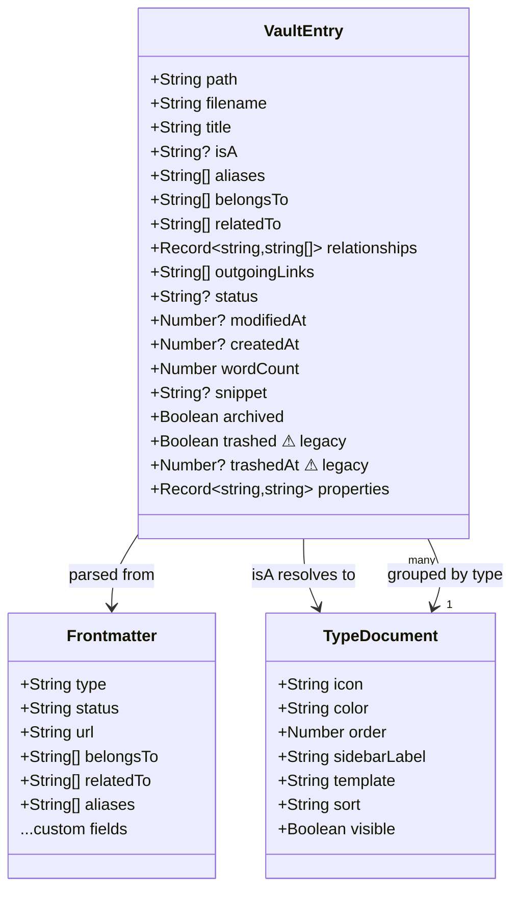
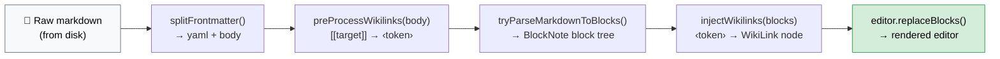
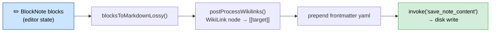

# Абстракции

Ключевые абстракции и доменные модели Tolaria.

## Философия проектирования

Абстракции Tolaria следуют принципу **convention over configuration**: стандартные имена полей и структуры папок имеют чётко определённые значения и автоматически вызывают поведение в UI. Это делает vault'ы читаемыми и для людей, и для AI-агентов: чем больше vault следует соглашениям, тем меньше кастомной конфигурации нужно AI, чтобы корректно по нему навигировать.

Полный набор принципов проектирования задокументирован в [ARCHITECTURE.md](./ARCHITECTURE.ru.md#принципы-проектирования).

## Семантические имена полей (соглашения)

Эти имена полей frontmatter имеют специальное значение в UI Tolaria:

| Поле | Значение | Поведение в UI |
|---|---|---|
| `title:` | Legacy fallback display-title для старых заметок | Используется только когда у заметки нет H1; новые заметки его не пишут автоматически |
| `type:` | Тип сущности (Project, Person, Quarter…) | Чип типа в note list + группировка в сайдбаре |
| `status:` | Стадия жизненного цикла (active, done, blocked…) | Цветной чип в note list + хедер редактора |
| `icon:` | Per-note иконка (emoji, имя Phosphor или HTTP/HTTPS URL изображения) | Рендерится на поверхностях заголовка заметки; редактируется из панели Properties |
| `url:` | Внешняя ссылка | Кликабельный чип-ссылка в хедере редактора |
| `date:` | Одиночная дата | Форматированный date-бейдж |
| `start_date:` + `end_date:` | Длительность/промежуток | Бейдж диапазона дат |
| `goal:` + `result:` | Прогресс | Индикатор прогресса в хедере редактора |
| `Workspace:` | Контекстный фильтр vault | Глобальный workspace-фильтр |
| `belongs_to:` | Родительская связь | Очеловечивается до `Belongs to` в UI |
| `related_to:` | Латеральная связь | Очеловечивается до `Related to` в UI |
| `has:` | Содержащая связь | Очеловечивается до `Has` в UI |

Поля связей определяются динамически: любое поле frontmatter, содержащее значения с `[[wikilink]]`, трактуется как связь (см. [ADR-0010](adr/0010-dynamic-wikilink-relationship-detection.md)). Собственный дефолтный словарь связей Tolaria использует snake_case на диске, но лейблы очеловечиваются на рендере, а уже существующие пользовательские ключи остаются нетронутыми.

### Системные свойства (соглашение с подчёркиванием)

Любое поле frontmatter, чьё имя начинается с `_`, — это **системное свойство**:

- Оно **не показывается** в панели Properties (ни для обычных заметок, ни для Type-заметок)
- Оно **не экспонируется** как видимое пользователю свойство в поиске, фильтрах и UI
- Его **можно редактировать** напрямую в raw-редакторе (продвинутые пользователи могут получить доступ при необходимости)
- Tolaria использует его внутри для конфигурации, поведения и UI-предпочтений

Примеры:
```yaml
_pinned_properties:       # which properties appear in the editor inline bar (per-type)
  - key: status
    icon: circle-dot
_icon: shapes             # icon assigned to a type
_color: blue              # color assigned to a type
_order: 10                # sort order in the sidebar
_sidebar_label: Projects  # override label in sidebar
```

**Это соглашение универсально** — применяйте его ко всем будущим системным полям frontmatter. Когда новой фиче нужно хранить конфигурацию во frontmatter заметки (особенно в Type-заметках), используйте `_field_name`, чтобы держать его скрытым от обычных пользовательских поверхностей, при этом сохраняя на диске как plain text.

Парсер frontmatter (Rust: `vault/mod.rs`, TS: `utils/frontmatter.ts`) должен фильтровать поля `_*` до передачи `properties` в UI.

## Document Model

Все данные живут в markdown-файлах с YAML frontmatter. Никакой базы данных нет — файловая система это и есть источник истины.

### VaultEntry

Основной тип данных, представляющий одну заметку, определён в Rust (`src-tauri/src/vault/mod.rs`) и TypeScript (`src/types.ts`).



```typescript
// src/types.ts
interface VaultEntry {
  path: string              // Absolute file path
  filename: string          // Just the filename
  title: string             // From first # heading, or filename fallback
  isA: string | null        // Entity type: Project, Procedure, Person, etc. (from frontmatter `type:` field)
  aliases: string[]         // Alternative names for wikilink resolution
  belongsTo: string[]       // Parent relationships (wikilinks)
  relatedTo: string[]       // Related entity links (wikilinks)
  relationships: Record<string, string[]>  // All frontmatter fields containing wikilinks
  outgoingLinks: string[]   // All [[wikilinks]] found in note body
  status: string | null     // Active, Done, Paused, Archived, Dropped
  modifiedAt: number | null // Unix timestamp (seconds)
  // Note: owner and cadence are now in the generic `properties` map
  createdAt: number | null  // Unix timestamp (seconds)
  fileSize: number
  wordCount: number | null  // Body word count (excludes frontmatter)
  snippet: string | null    // First 200 chars of body
  archived: boolean         // Archived flag
  trashed: boolean          // Kept for backward compatibility (Trash system removed — delete is permanent)
  trashedAt: number | null  // Kept for backward compatibility (Trash system removed)
  properties: Record<string, string>  // Scalar frontmatter fields (custom properties)
}
```

### Типы сущностей (isA / type)

Тип сущности хранится в поле frontmatter `type:` (например, `type: Quarter`). Legacy-имя поля `Is A:` всё ещё принимается как алиас для обратной совместимости, но новые заметки используют `type:`. Свойство `VaultEntry.isA` в TypeScript/Rust держит разрешённое значение.

Тип определяется **исключительно** по полю frontmatter `type:` — он никогда не выводится из расположения файла в папке. Все заметки живут в корне vault как плоские `.md`-файлы:

```
~/Laputa/
├── my-project.md          ← type: Project (in frontmatter)
├── weekly-review.md       ← type: Procedure
├── john-doe.md            ← type: Person
├── some-topic.md          ← type: Topic
├── AGENTS.md              ← canonical Tolaria AI guidance
├── CLAUDE.md              ← compatibility shim pointing at AGENTS.md
├── ...
└── type/                  ← type definition documents
```

Новые заметки создаются в корне vault: `{vault}/{slug}.md`. Изменение типа заметки требует только обновления поля `type:` во frontmatter — файл не перемещается. Перемещение заметки в пользовательскую папку — отдельная файловая забота: путь к папке меняется, но заметка сохраняет тот же filename и значение `type:`. Папка `type/` существует исключительно для документов-определений типов. Legacy-содержимое `config/` всё ещё распознаётся при миграции и repair, но управляемое Tolaria AI-руководство теперь живёт в корне vault.

Доступна команда миграции `flatten_vault` для перемещения существующих заметок из подпапок по типам в корень vault.

### Типы как файлы

У каждого типа сущности может быть соответствующий **type-документ** в папке `type/` (например, `type/project.md`, `type/person.md`). Type-документы:

- Имеют `type: Type` в своём frontmatter (`Is A: Type` тоже принимается как legacy-алиас)
- Определяют метаданные типа: иконку, цвет, порядок, sidebar label, template, sort, view, visibility
- Являются навигируемыми сущностями — они появляются в сайдбаре под "Types" и могут быть открыты/отредактированы как любая заметка
- Служат «определением» для своей категории типа

**Свойства type-документа** (читаются Rust и используются в UI):

| Свойство | Тип | Описание |
|----------|------|-------------|
| `icon` | string | Иконка типа как имя Phosphor (kebab-case, например, "cooking-pot") |
| `color` | string | Акцентный цвет: red, purple, blue, green, yellow, orange |
| `order` | number | Порядок отображения в сайдбаре (меньше = выше приоритет) |
| `sidebar_label` | string | Кастомный лейбл, переопределяющий авто-плюрализацию |
| `template` | string | Markdown-шаблон для новых заметок этого типа |
| `sort` | string | Дефолтная сортировка: "modified:desc", "title:asc", "property:Priority:asc" |
| `view` | string | Дефолтный режим вида: "all", "editor-list", "editor-only" |
| `visible` | bool | Появляется ли тип в сайдбаре (default: true) |

**Связь с типом**: когда у любого entry есть значение `isA` (например, "Project"), Rust-бэкенд автоматически добавляет запись `"Type"` в его HashMap `relationships`, указывающую на `[[type/project]]`. Это делает тип навигируемым из панели Inspector.

**Поведение в UI**:
- Клик на хедер группы секции пинит type-документ наверху NoteList, если он существует
- Просмотр type-документа в режиме сущности показывает группу "Instances" со списком всех entries этого типа
- Поле Type в Inspector рендерится как кликабельный чип, навигирующий к type-документу

### Формат frontmatter

Стандартный YAML-frontmatter между разделителями `---`:

```yaml
---
title: Write Weekly Essays
type: Procedure
status: Active
belongs_to:
  - "[[grow-newsletter]]"
related_to:
  - "[[writing]]"
aliases:
  - Weekly Writing
---
```

Поддерживаемые типы значений (определены в `src-tauri/src/frontmatter/yaml.rs` как `FrontmatterValue`):
- **String**: `status: Active`
- **Number**: `priority: 5`
- **Bool**: `archived: true`
- **List**: многострочный `  - item` или инлайн `[item1, item2]`
- **Null**: `owner:` (пустое значение)

### Кастомные связи

Rust-парсер сканирует все ключи frontmatter на наличие полей, содержащих `[[wikilinks]]`. Любое нестандартное поле со значениями wikilink захватывается в HashMap `relationships`:

```yaml
---
Topics:
  - "[[writing]]"
  - "[[productivity]]"
Key People:
  - "[[matteo-cellini]]"
---
```

Становится: `relationships["Topics"] = ["[[writing]]", "[[productivity]]"]`

Это позволяет иметь произвольные расширяемые типы связей без изменений в коде.

### Исходящие ссылки

Все `[[wikilinks]]` в теле заметки (не во frontmatter) извлекаются регулярным выражением и хранятся в `outgoingLinks`. Используются для детекции backlinks и графов связей.

### Title / Filename Sync

Tolaria разделяет **display title** и идентификатор файла:

- **Резолв display title** (`extract_title` в `vault/parsing.rs`): сначала первый `# H1` на первой непустой строке тела, потом legacy frontmatter `title:`, потом slug-to-title из стема filename.
- **Открытие заметки read-only**: выбор заметки не инжектит и не автокорректирует frontmatter `title:`.
- **Явные действия с filename** (`rename_note`): действия rename/sync из breadcrumb стейджат crash-safe переименования заметок через скрытую транзакционную директорию `.tolaria-rename-txn/`, восстанавливают незавершённые переименования при следующем сканировании vault, обновляют wikilinks по всему vault и показывают любые сбои переписывания backlinks вместо тихого сообщения о частичном успехе. Тело редактора остаётся поверхностью редактирования заголовка.
- **Портативная валидация filename** (`vault/filename_rules.rs`): filenames заметок, имена папок и filenames кастомных представлений отвергают зарезервированные Windows device-имена, недопустимые символы и хвостовые точки/пробелы, чтобы vault, созданный на macOS/Linux, чисто клонировался и синкался на Windows.
- **Untitled drafts** начинаются как `untitled-*.md` и автоматически переименовываются при сохранении, как только заметка получает H1.

### Title Surface (UI)

Тело BlockNote — единственная поверхность редактирования заголовка:

- Первый H1 — это канонический display title.
- Над редактором нет отдельной строки заголовка, даже когда у заметки нет H1.
- Заметки без H1 показывают только тело редактора и плейсхолдер.
- Изменения filename — это явные действия из breadcrumb, а не побочный эффект отдельного title-input.

### Sidebar Selection

Состояние навигации моделируется как discriminated union:

```typescript
type SidebarFilter = 'all' | 'archived' | 'changes' | 'pulse'

type SidebarSelection =
  | { kind: 'filter'; filter: SidebarFilter }
  | { kind: 'sectionGroup'; type: string }    // e.g. type: 'Project'
  | { kind: 'folder'; path: string }
  | { kind: 'entity'; entry: VaultEntry }      // Neighborhood source note
  | { kind: 'view'; filename: string }
```

`SidebarSelection.kind === 'folder'` — это первоклассная цель навигации, а не просто визуальная подсветка.

- `FolderTree` декомпозирует поверхность взаимодействия с папками на `FolderTreeRow`, `FolderNameInput`, `FolderContextMenu` и хуки disclosure/контекстного меню, чтобы рендеринг вложенных строк, инлайн-переименование и действия по правому клику оставались изолированными.
- `useFolderActions()` композирует `useFolderRename()` и `useFolderDelete()`, чтобы мутации папок учитывали выбор, при этом остальной `App.tsx` лишь подключает результирующие колбэки в `Sidebar` и реестр команд.
- `useNoteRetargeting()` — общая абстракция retargeting для drop'ов заметок и действий командной палитры. Она владеет проверками "можно ли сюда дропнуть?", обновляет `type:` через frontmatter, когда заметка приземляется на секцию типа, и делегирует перемещения в папки через тот же crash-safe pipeline переименования, который используют backend-команды rename.
- Успешное переименование папки перезагружает дерево папок плюс vault entries, переписывает любые затронутые folder-scoped вкладки и обновляет `SidebarSelection` на новый относительный путь, когда переименованная папка остаётся выбранной.
- Удаление папки очищает pending-состояние переименования, подтверждает деструктивное намерение, сбрасывает затронутые folder-scoped вкладки, перезагружает данные vault и сбрасывает выбор папки, если удалённое поддерево владело текущим выбором.

### Neighborhood Mode

`SidebarSelection.kind === 'entity'` — это режим Tolaria Neighborhood для просмотра note-list.

- Выбранный `entry` — это исходная заметка neighborhood.
- Исходная заметка остаётся пинутой наверху note list как стандартная активная строка, не как специальная карточка.
- Группы исходящих связей рендерятся первыми по `relationships`-карте заметки.
- Обратные группы (`Children`, `Events`, `Referenced by`) и `Backlinks` рендерятся после групп исходящих связей.
- Пустые группы остаются видимыми со счётчиком `0`.
- Заметки могут появляться в нескольких группах, когда несколько связей одновременно истинны; режим Neighborhood не дедуплицирует их между секциями.
- Обычный клик / `Enter` открывают сфокусированную заметку без замены текущего Neighborhood.
- Cmd/Ctrl-клик и Cmd/Ctrl-`Enter` открывают заметку и поворачивают note list в Neighborhood этой заметки.

## Интеграция с файловой системой

### Сканирование vault (Rust)

`vault::scan_vault(path)` в `src-tauri/src/vault/mod.rs`:

1. Валидирует, что путь существует и это директория
2. Сканирует `.md`-файлы корневого уровня (нерекурсивно)
3. Рекурсивно сканирует защищённые папки: `type/`, legacy `config/`, `attachments/`
4. Файлы в незащищённых подпапках **не индексируются** (enforcement плоского vault)
5. Для каждого `.md`-файла вызывает `parse_md_file()`:
   - Читает содержимое через `fs::read_to_string()`
   - Парсит frontmatter через `gray_matter::Matter::<YAML>`
   - Извлекает заголовок из первого `#`-хедера
   - Читает тип сущности из поля frontmatter `type:` (`Is A:` принимается как legacy-алиас); тип никогда не выводится из папки
   - Парсит даты как ISO 8601 в Unix-таймстампы
   - Извлекает связи, исходящие ссылки, кастомные свойства, word count, сниппет

Дерево папок скрывает только специальный каталог `type/`, поскольку у типов заметок уже есть своя секция в сайдбаре. Дефолтные папки vault, такие как `attachments/` и `views/`, остаются видимыми наряду с папками, созданными пользователем.
6. Сортирует по `modified_at` по убыванию
7. Пропускает файлы, которые не парсятся, с warning-логом

Команда `vault_health_check` детектит файлы-отщепенцы в незащищённых подпапках и несоответствия filename-title. При загрузке vault миграционный баннер предлагает уплостить файлы-отщепенцы в корень через `flatten_vault`.

Доступ к путям на уровне команд огорожен активным vault до того, как файловые операции достигают backend vault. `src-tauri/src/commands/vault/boundary.rs` канонизирует сконфигурированный/запрашиваемый корень vault, отвергает побеги через `..` и абсолютные пути за пределами этого корня и валидирует записываемые цели через ближайшего существующего предка, чтобы чтения, сохранения, удаления заметок, правки view-файлов, мутации папок и записи вложений-картинок не могли выйти за пределы активного vault. Команды для вложений-картинок обновляют runtime asset scope после сохранения, чтобы файлы, созданные под ранее отсутствовавшей директорией `attachments/`, могли рендериться сразу.

### Кэширование vault

`vault::scan_vault_cached(path)` оборачивает сканирование git-based кэшированием:

1. Читает кэш из `~/.laputa/cache/<vault-hash>.json` (внешний относительно vault)
2. Сравнивает версию кэша, путь vault и hash коммита git HEAD
3. Если кэш валиден и тот же коммит → перепарсивает только незакоммиченные изменённые файлы
4. Если другой коммит → использует `git diff` для поиска изменённых файлов → выборочный re-parse
5. Если кэша нет → полный скан
6. Заменяет кэш через write-в-temp-файл + rename только если кратковременный writer-lock и проверка fingerprint кэша покажут, что другой скан ещё не обновил его
7. При первом запуске мигрирует любой legacy `.laputa-cache.json` изнутри vault

### Манипуляции с frontmatter (Rust)

`frontmatter/ops.rs:update_frontmatter_content()` выполняет построчное редактирование YAML:

1. Находит блок frontmatter между разделителями `---`
2. Итерирует по строкам в поисках целевого ключа
3. Если найден: заменяет значение (потребляя многострочные list-элементы при наличии)
4. Если не найден: добавляет новую пару ключ-значение в конец
5. Если frontmatter не существует: создаёт новый блок `---`

Хелпер `with_frontmatter()` оборачивает это в цикл read-transform-write на самом файле.

### Загрузка содержимого

- **Tauri mode**: содержимое загружается по запросу при открытии вкладки через `invoke('get_note_content', { path })`
- **Browser mode**: всё содержимое загружается при старте из mock-данных
- Содержимое для детекции backlinks (`allContent`) хранится в памяти как `Record<string, string>`

## Интеграция с Git

Git-операции живут в `src-tauri/src/git/`. Все операции выполняются через CLI `git` (не libgit2).

### Типы данных

```typescript
interface GitCommit {
  hash: string
  shortHash: string
  message: string
  author: string
  date: number       // Unix timestamp
}

interface ModifiedFile {
  path: string          // Absolute path
  relativePath: string  // Relative to vault root
  status: 'modified' | 'added' | 'deleted' | 'untracked' | 'renamed'
}

interface GitRemoteStatus {
  branch: string
  ahead: number
  behind: number
  hasRemote: boolean
}

interface GitAddRemoteResult {
  status: 'connected' | 'already_configured' | 'incompatible_history' | 'auth_error' | 'network_error' | 'error'
  message: string
}

interface PulseCommit {
  hash: string
  shortHash: string
  message: string
  date: number
  githubUrl: string | null
  files: PulseFile[]
  added: number
  modified: number
  deleted: number
}
```

### Операции

| Модуль | Операция | Заметки |
|--------|-----------|-------|
| `history.rs` | История файла | `git log` — последние 20 коммитов на файл |
| `status.rs` | Модифицированные файлы | `git status --porcelain` — отфильтровано до `.md` |
| `status.rs` | Diff файла | `git diff`, fallback на `--cached`, потом синтетический для untracked |
| `commit.rs` | Commit | `git add -A && git commit -m "..."`; сломанные signing-хелперы триггерят один unsigned-ретрай для того же управляемого приложением коммита |
| `remote.rs` | Pull / Push | `git pull --rebase` / `git push` |
| `connect.rs` | Add remote | Добавляет `origin`, фетчит его, валидирует совместимость истории и начинает tracking только когда remote безопасен |
| `conflict.rs` | Разрешение конфликтов | Детект конфликтов, разрешение через ours/theirs/manual |
| `pulse.rs` | Лента активности | `git log` с `--name-status` для изменений файлов |

### Auto-Sync

Хук `useAutoSync` обрабатывает автоматический git-sync:
- Настраиваемый интервал (из настроек приложения: `auto_pull_interval_minutes`)
- Pull'ит на интервале, push'ит после коммитов
- Дожидается post-pull обновления vault, чтобы toasts появлялись после того, как состояние note-list свежее
- Переоткрывает чистую активную вкладку с диска после успешного pull-обновления, чтобы редактор и note list оставались выровнены
- Детектит merge-конфликты → открывает `ConflictResolverModal`
- Отслеживает remote-статус (branch, ahead/behind через `git_remote_status`)
- Обрабатывает отказ push (расхождение) → ставит статус `pull_required`
- `pullAndPush()`: pull'ит, потом авто-push'ит для восстановления после расхождения
- `ConflictNoteBanner`: инлайн-баннер в редакторе для конфликтующих заметок (Keep mine / Keep theirs)

`useGitRemoteStatus` — компаньон commit-time для `useAutoSync`:
- Перепроверяет `git_remote_status`, когда открывается диалог Commit, и прямо перед submit
- Конвертирует `hasRemote: false` в путь локального коммита
- Не меняет нормальный путь push для vault'ов, у которых есть remote

`AddRemoteModal` — это явный путь восстановления для таких local-only vault'ов:
- Открывается из чипа статус-бара `No remote` и из командной палитры
- Вызывает `git_add_remote` с текущим путём vault и вставленным URL репозитория
- Показывает сбои auth, network и incompatible-history инлайн без переписывания истории локального vault

`useAutoGit` — компаньон checkpoint-time для обоих хуков:
- Потребляет installation-local настройки AutoGit (`autogit_enabled`, idle threshold, inactive threshold)
- Отслеживает последнюю значимую активность в редакторе плюс переходы focus/visibility приложения
- Триггерит `useCommitFlow.runAutomaticCheckpoint()` только когда vault git-backed, есть pending-изменения и не остаётся несохранённых правок
- Делит тот же детерминированный генератор сообщений автоматического коммита с кнопкой Commit в нижней панели, поэтому checkpoints, управляемые таймером, и ручные быстрые коммиты производят одинаковые сообщения `Updated N note(s)` / `Updated N file(s)`

### Интеграция фронтенда

- **Бейджи модифицированных файлов**: оранжевые точки в сайдбаре
- **Diff-вид**: тумблер в breadcrumb-баре → показывает унифицированный diff
- **Git history**: показывается в Inspector для активной заметки
- **Commit dialog**: триггерится из сайдбара или Cmd+K
- **Индикатор No remote**: нейтральный чип в нижней панели, когда `GitRemoteStatus.hasRemote === false`
- **Pulse view**: лента активности при выбранном фильтре Pulse
- **Pull command**: Cmd+K → "Pull from Remote", также в меню Vault
- **Git status popup**: клик по sync-бейджу → показывает branch, ahead/behind, кнопку Pull
- **Conflict banner**: инлайн-баннер в редакторе с Keep mine / Keep theirs для конфликтующих заметок

## Кастомизация BlockNote

Редактор использует [BlockNote](https://www.blocknotejs.org/) для богатого редактирования текста, с CodeMirror 6 как альтернативой для raw-редактирования.

### Кастомный wikilink inline content

Определён в `src/components/editorSchema.tsx`:

```typescript
const WikiLink = createReactInlineContentSpec(
  {
    type: "wikilink",
    propSchema: { target: { default: "" } },
    content: "none",
  },
  { render: (props) => <span className="wikilink">...</span> }
)
```

### Подсветка кодовых блоков

Определена в `src/components/editorSchema.tsx` и стилизована в `src/components/EditorTheme.css`:

- Схема переопределяет дефолтную BlockNote-спецификацию `codeBlock` через `createCodeBlockSpec({ ...codeBlockOptions, defaultLanguage: "text" })` из `@blocknote/code-block`.
- Fenced code-блоки теперь используют поддерживаемый BlockNote путь подсветки на базе Shiki, который рендерит `.shiki` token-span'ы прямо внутри DOM редактора.
- Tolaria держит `defaultLanguage: "text"`, чтобы код-блоки без лейбла молча не превращались в JavaScript, при этом всё ещё поддерживая упакованные алиасы языков, такие как `ts` → `typescript`.
- Стилизация чипа inline-кода остаётся ограниченной `.bn-inline-content code`, поэтому fenced-узлы `pre > code` сохраняют тёмную оболочку BlockNote вместо наследования muted inline-поверхности.

### Политика поверхности форматирования

Определена в `src/components/tolariaEditorFormatting.tsx` и `src/components/tolariaEditorFormattingConfig.ts`:

- `SingleEditorView` отключает дефолтные toolbar форматирования, меню `/` и боковое меню BlockNote, затем монтирует контроллеры, принадлежащие Tolaria, чтобы видимая поверхность форматирования соответствовала гарантиям markdown round-trip Tolaria.
- Toolbar форматирования экспонирует только инлайн-контролы, которые сохраняются через `blocksToMarkdownLossy()` в pipeline сохранения Tolaria: bold, italic, strike, вложенность и создание ссылки. Контролы, которые BlockNote может временно отрисовать, но Tolaria не может верно сохранить — такие как underline, color, alignment и dropdown типа блока — скрыты, вместо того чтобы выглядеть рабочими и потом исчезать.
- Контроллер toolbar форматирования Tolaria также держит file/image-действия примонтированными через крошечный hover-зазор между image-блоком и плавающим toolbar, и пока сам toolbar в hover, чтобы image-контролы оставались юзабельными, а не схлопывались посреди взаимодействия.
- Slash-меню `/` остаётся поддерживаемым путём для markdown-безопасных трансформаций блока, таких как заголовки, цитаты и блоки списков. Tolaria отфильтровывает варианты toggle-heading и toggle-list BlockNote, потому что они не мапятся чисто в markdown-модель заметки.
- Боковое меню block-handle сохраняет только действия, которые переживают markdown round-trip Tolaria. Delete и тумблеры заголовков таблиц остаются доступны; подменю BlockNote `Colors` удалено, потому что цвета блоков не входят в поддерживаемую markdown-поверхность Tolaria.
- `useNoteWikilinkDrop()` — общая абстракция editor-drop для перетаскивания строк заметки в любой режим редактора. Она читает существующий note-retargeting drag payload, разрешает vault-relative стем и вставляет канонический `[[wikilink]]`, не угоняя несвязанные plain-text drag'и.

### Pipeline Markdown-to-BlockNote



> Plaсeholder-токены используют `‹` и `›`, чтобы не пересекаться с синтаксисом markdown.

### Pipeline BlockNote-to-Markdown (Save)



### Навигация по wikilink

Два механизма навигации:

1. **Click handler**: DOM event listener на `.editor__blocknote-container` ловит клики на элементах `.wikilink` → `onNavigateWikilink(target)`.
2. **Suggestion menu**: набор `[[` триггерит `SuggestionMenuController` с отфильтрованными vault entries.

Резолв wikilink (`resolveEntry` в `src/utils/wikilink.ts`) использует multi-pass матчинг с глобальным приоритетом: filename-стем (самый сильный) → alias → точный заголовок → очеловеченный заголовок (kebab-case → words). Никакого path-based матчинга — flat vault использует только title/filename. Legacy path-style цели вроде `[[person/alice]]` поддерживаются извлечением последнего сегмента.

### Режим Raw-редактора

Тумблер через Cmd+K → "Raw Editor" или кнопку breadcrumb-бара. Использует CodeMirror 6 (хук `useCodeMirror`) для прямого редактирования raw markdown + frontmatter. Изменения сохраняются через ту же команду `save_note_content`.
Пока пользователь печатает, `useEditorSaveWithLinks` выводит транзитный патч `VaultEntry` из парсимого frontmatter, чтобы Inspector, чипы связей и видимые в note-list метаданные оставались синхронизированы с raw-редактором до следующей перезагрузки vault. Временно невалидный или недопечатанный frontmatter игнорируется до тех пор, пока он снова не станет парсимым, что позволяет не затирать последнее известное хорошее производное состояние.

### Нормализация лигатур стрелок

Набранные ASCII-последовательности стрелок нормализуются согласованно в обоих режимах редактора:

- Ввод в богатом редакторе монтирует `createArrowLigaturesExtension()` (`src/components/arrowLigaturesExtension.ts`) в BlockNote и перехватывает набранные события `beforeinput` до того, как ProseMirror закоммитит символ.
- Ввод в raw-редакторе использует путь CodeMirror `inputHandler` в `useCodeMirror`, чтобы те же правила лигатур применялись при прямом редактировании markdown-исходника.
- Оба пути делегируют общему хелперу `resolveArrowLigatureInput()` в `src/utils/arrowLigatures.ts`, который приоритизирует `<->` над частичными совпадениями, оставляет вставку буквальной и позволяет экранированным формам, таким как `\\->` и `\\<->`, оставаться ASCII.

## Стилизация

Приложение использует внутренние светлую и тёмную темы, принадлежащие Tolaria (см. [ADR-0081](adr/0081-internal-light-dark-theme-runtime.md)). Предыдущая система тем, авторизованных vault, остаётся удалённой; theme mode — это installation-local предпочтение приложения.

1. **Глобальные CSS-переменные** (`src/index.css`): семантические цвета приложения, бордеры, поверхности и состояния взаимодействия через `:root` / `[data-theme]`, связанные с Tailwind v4
2. **Тема редактора** (`src/theme.json`): типографика BlockNote, сплющенная в CSS-переменные хуком `useEditorTheme`
3. **Runtime-мост темы**: применяет `data-theme` и `.dark` для shadcn/ui, тогда как CodeMirror и editor-specific консьюмеры выводят любые non-CSS-variable значения из того же семантического контракта

## Inspector Abstraction

Панель Inspector (`src/components/Inspector.tsx`) композирована из под-панелей:

1. **DynamicPropertiesPanel** (`src/components/DynamicPropertiesPanel.tsx`): рендерит frontmatter как редактируемые пары ключ-значение:
   - **Редактируемые свойства** (сверху): Type-бейдж, Status pill с dropdown, числовые поля, boolean-тумблеры, array tag pills, текстовые поля. Взаимодействие click-to-edit.
   - **Режимы отображения свойств**: `text`, `number`, `date`, `boolean`, `status`, `url`, `tags` и `color`. Числовые значения frontmatter авто-детектятся как `number`, а кастомные скалярные ключи можно явно переключить на `Number` через property-type контрол.
   - **Info-секция** (внизу, отделена бордером): read-only производные метаданные — Modified, Created, Words, File Size. Использует приглушённую стилизацию без взаимодействия.
   - Ключи в `SKIP_KEYS` (`type`, `aliases`, `notion_id`, `workspace`, `is_a`, `Is A`) скрыты от редактируемой секции.

2. **RelationshipsPanel**: показывает `belongs_to`, `related_to`, `has` и все кастомные поля связей как кликабельные wikilink-чипы. Лейблы связей очеловечены для отображения, но хранимые ключи остаются неизменными.

3. **BacklinksPanel**: сканирует `allContent` на наличие заметок, ссылающихся на текущую через `[[title]]` или `[[path]]`.

4. **GitHistoryPanel**: показывает недавние коммиты из истории файла с относительными timestamps.

## Поиск

### Поиск

Keyword-based поиск сканирует все `.md`-файлы vault через `walkdir`:

```typescript
interface SearchResult {
  title: string
  path: string
  snippet: string
  score: number
}
```

### Интеграция поиска

Компонент `SearchPanel` обеспечивает UI поиска:
- Real-time результаты по мере набора (300ms debounce)
- Клик по результату открывает заметку в редакторе
- Показывает релевантность и сниппет

Шаг индексации не требуется — поиск идёт прямо по файловой системе.

## Управление vault

### Переключение vault

Хук `useVaultSwitcher` управляет несколькими vault'ами:
- Сохраняет список vault'ов в `~/.config/com.tolaria.app/vaults.json` (читает legacy `com.laputa.app` при апгрейде)
- Переключение закрывает все вкладки и сбрасывает sidebar
- Поддерживает добавление, удаление, скрытие/восстановление vault'ов
- Дефолтный vault: публичный starter-vault Getting Started, клонируемый по запросу

### Конфиг vault

Per-vault настройки хранятся локально и скоупятся по пути vault:
- Управляется хуком `useVaultConfig` и `vaultConfigStore`
- Настройки: zoom, view mode, tag colors, status colors, property display modes, переопределения колонок note-list для Inbox, тумблер explicit organization workflow
- Одноразовая миграция из localStorage (`configMigration.ts`)

### Файлы AI-руководства

Tolaria отслеживает управляемое vault-level AI-руководство отдельно от обычного содержимого заметок:
- `AGENTS.md` — это канонический управляемый файл руководства для Tolaria-aware coding-агентов
- `CLAUDE.md` — это compatibility-шим, который указывает Claude Code обратно на `AGENTS.md`
- `useVaultAiGuidanceStatus` читает `get_vault_ai_guidance_status` и нормализует backend-состояние в четыре UI-кейса: `managed`, `missing`, `broken` и `custom`
- `restore_vault_ai_guidance` чинит только файлы, управляемые Tolaria; пользовательские кастомные `AGENTS.md` / `CLAUDE.md` показываются как custom и остаются нетронутыми
- AI-бейдж в статус-баре и командная палитра потребляют эту абстракцию, чтобы экспонировать действия restore только когда управляемое руководство отсутствует или сломано

### Getting Started / Onboarding

Хук `useOnboarding` детектит первый запуск:
- Если путь vault не существует → показать `WelcomeScreen`
- Пользователь может создать новый пустой vault, открыть существующую папку или клонировать публичный Getting Started vault в выбранную родительскую папку; Tolaria выводит финальный дочерний путь `Getting Started` до клонирования
- После завершения клонирования starter-репо Tolaria удаляет каждый remote, чтобы новый vault открывался local-only по умолчанию
- Состояние welcome отслеживается в localStorage (`tolaria_welcome_dismissed`, с legacy fallback)

`useGettingStartedClone` инкапсулирует non-onboarding действие Getting Started:
- Открывает тот же picker родительской папки, что и onboarding
- Выводит финальный путь назначения `.../Getting Started`
- Показывает разрешённый путь через app toast после успешного клонирования

`useAiAgentsOnboarding(enabled)` добавляет отдельный first-launch шаг агентов:
- Читает локальный флаг dismissal для prompt'а AI-агентов (с legacy fallback на старый Claude-only ключ)
- Показывается только после того, как vault-onboarding уже разрешился в готовое состояние
- Локально хранит dismissal, как только пользователь продолжит

### Удалённые git-операции

Tolaria делегирует remote-аутентификацию системной настройке git пользователя:
- `CloneVaultModal` захватывает remote URL и локальное место назначения
- `clone_git_repo` и `create_getting_started_vault` оба запускают системную работу git clone в blocking Tokio-задачах, чтобы UI клонирования оставался отзывчивым
- `git_add_remote` использует тот же путь системного git и отвергает remote'ы, чья история несвязанна или впереди локального vault
- Существующие команды `git_pull` / `git_push` продолжают пробрасывать сырые git-ошибки, а команды клонирования fail-fast'ят, когда git хочет интерактивный ввод в терминал
- В настройках приложения не хранится provider-специфичный токен или username

## Settings

App-level настройки сохраняются в `~/.config/com.tolaria.app/settings.json` (читает legacy `com.laputa.app` при апгрейде):

```typescript
interface Settings {
  auto_pull_interval_minutes: number | null
  autogit_enabled: boolean | null
  autogit_idle_threshold_seconds: number | null
  autogit_inactive_threshold_seconds: number | null
  telemetry_consent: boolean | null
  crash_reporting_enabled: boolean | null
  analytics_enabled: boolean | null
  anonymous_id: string | null
  release_channel: string | null // null = stable default, "alpha" = every-push prerelease feed
  theme_mode: 'light' | 'dark' | null
  default_ai_agent: 'claude_code' | 'codex' | null
}
```

Управляется хуком `useSettings` и компонентом `SettingsPanel`. `theme_mode` — installation-local, потому что контролирует комфорт устройства, а не структуру vault. `default_ai_agent` — installation-local предпочтение, выбирающее, на какой поддерживаемый CLI-агент по умолчанию должны таргетиться панель AI, AI-режим командной палитры и статус-бар. Поля AutoGit тоже installation-local: `useAutoGit` потребляет их, чтобы планировать автоматические checkpoints, тогда как `useCommitFlow` и быстрое действие статус-бара переиспользуют тот же checkpoint runner и детерминированную генерацию автоматического commit-сообщения.

## Telemetry

### Компоненты
- **`TelemetryConsentDialog`** — диалог первого запуска, спрашивающий пользователя об opt-in в анонимный crash reporting. Две кнопки: accept (ставит `telemetry_consent: true`, генерирует `anonymous_id`) или decline.
- **`TelemetryToggle`** — компонент-чекбокс в `SettingsPanel` для тумблеров crash reporting и аналитики.

### Хуки
- **`useTelemetry(settings, loaded)`** — реактивно инициализирует/тушит Sentry и PostHog на основе настроек. Вызывается один раз в `App`.

### Библиотеки
- **`src/lib/telemetry.ts`** — `initSentry()`, `teardownSentry()`, `initPostHog()`, `teardownPostHog()`, `trackEvent()`. Path-скраббер через хук `beforeSend`. DSN/key из env-переменных `VITE_SENTRY_DSN` / `VITE_POSTHOG_KEY`.
- **`src/main.tsx`** — колбэки ошибок React-корня (`onCaughtError`, `onUncaughtError`, `onRecoverableError`) форвардят контекст component-stack в `Sentry.reactErrorHandler()` для отлаживаемых production React-ошибок.
- **`src-tauri/src/telemetry.rs`** — Rust-side инициализация Sentry с path-скраббером `beforeSend`. `init_sentry_from_settings()` читает настройки и условно инициализирует. `reinit_sentry()` для runtime-тумблера.

### Tauri Commands
- **`reinit_telemetry`** — перечитывает настройки и тумблит Rust Sentry on/off. Вызывается из фронтенда, когда пользователь меняет настройку crash reporting.

---

## Updates & Feature Flags

### Хуки
- **`useUpdater(releaseChannel)`** — channel-aware state machine updater'а. Проверяет выбранный feed, показывает состояния available/downloading/ready и делегирует работу install Rust.
- **`useFeatureFlag(flag)`** — возвращает boolean для именованного feature flag. Проверяет override в `localStorage` (`ff_<name>`), потом откатывается на telemetry-backed оценку. Type-safe через union `FeatureFlagName`.

### Frontend-хелперы
- **`src/lib/releaseChannel.ts`** — нормализует сохранённые значения канала, чтобы legacy или невалидные настройки откатывались на Stable, тогда как Stable сериализуется обратно в `null`.
- **`src/lib/appUpdater.ts`** — тонкая обёртка вокруг команд Tauri-updater. Держит React-хук свободным от деталей выбора endpoint.

### Rust
- **`src-tauri/src/app_updater.rs`** — выбирает корректный endpoint обновления (`alpha/latest.json` или `stable/latest.json`) и адаптирует результаты Tauri-updater в frontend-friendly payload.
- **`src-tauri/src/commands/version.rs`** — форматирует лейблы билд/версии приложения для статус-бара, включая календарные alpha-лейблы и legacy-совместимость релизов.

### Tauri Commands
- **`check_for_app_update`** — channel-aware lookup манифеста обновления.
- **`download_and_install_app_update`** — channel-aware download/install со стримящимися событиями прогресса.

### CI/CD
- **`.github/workflows/release.yml`** — alpha-prereleases с каждого push'а в `main` с использованием технических версий calendar-semver (`YYYY.M.D-alpha.N`) и чистых имён релизов `Alpha YYYY.M.D.N`. GitHub alpha-теги дополняют последовательность prerelease нулями (`alpha-vYYYY.M.D-alpha.NNNN`), чтобы порядок релизов GitHub оставался хронологическим, тогда как поставляемая версия приложения остаётся `YYYY.M.D-alpha.N`. Публикует `alpha/latest.json` и обновляет legacy-алиасы `latest.json` / `latest-canary.json` на alpha-feed.
- **`.github/workflows/release-stable.yml`** — stable-релизы из тегов `stable-vYYYY.M.D`. Публикует `stable/latest.json`, артефакты macOS Apple Silicon, Windows x64 installer/updater bundles и Linux x86_64 `.deb` / AppImage артефакты.
- **Beta-когорты** обрабатываются только в targeting PostHog. Никакого beta updater feed нет.
