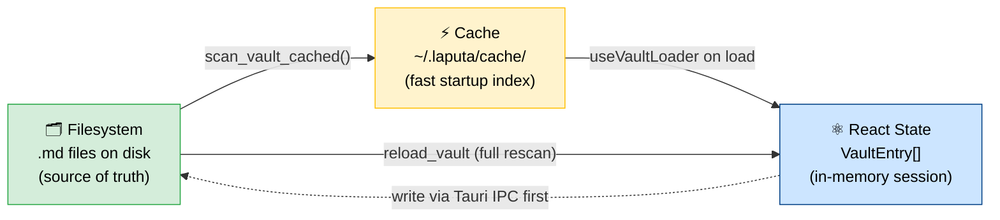
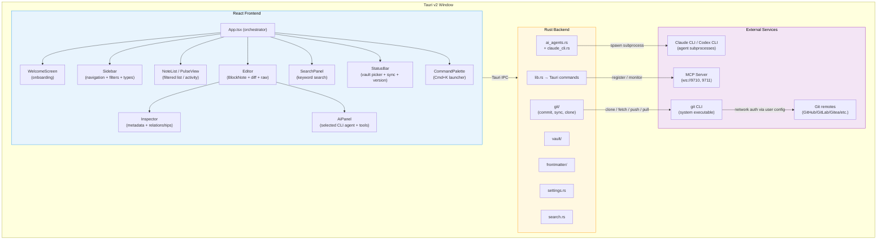
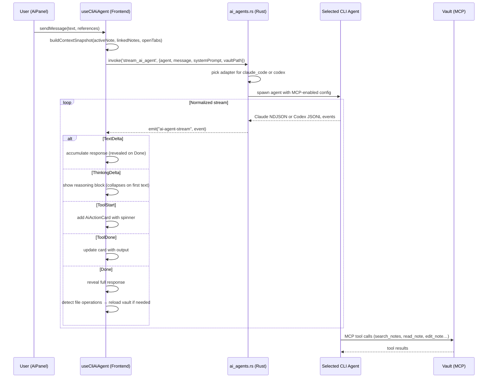
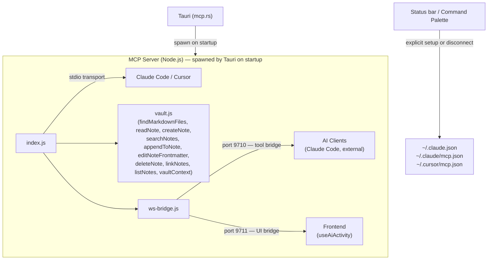
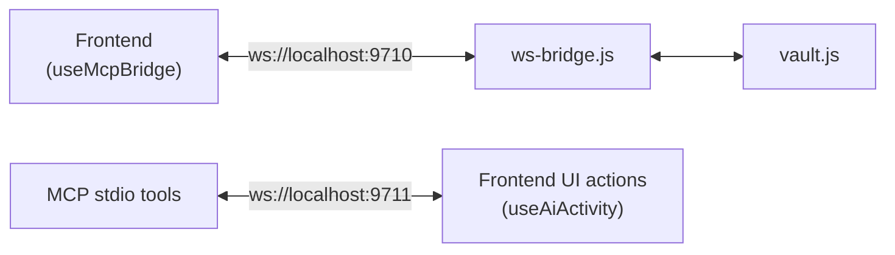
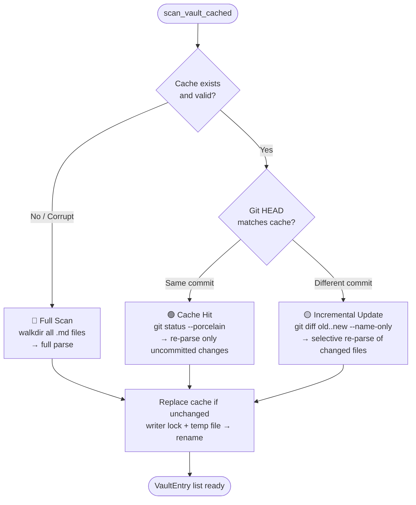
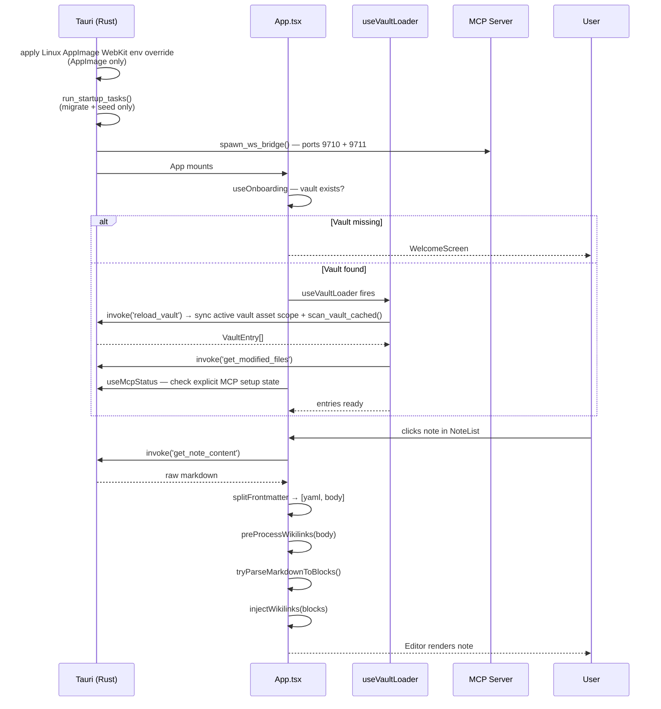
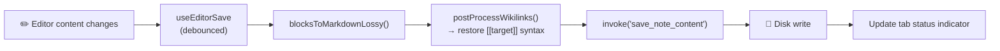
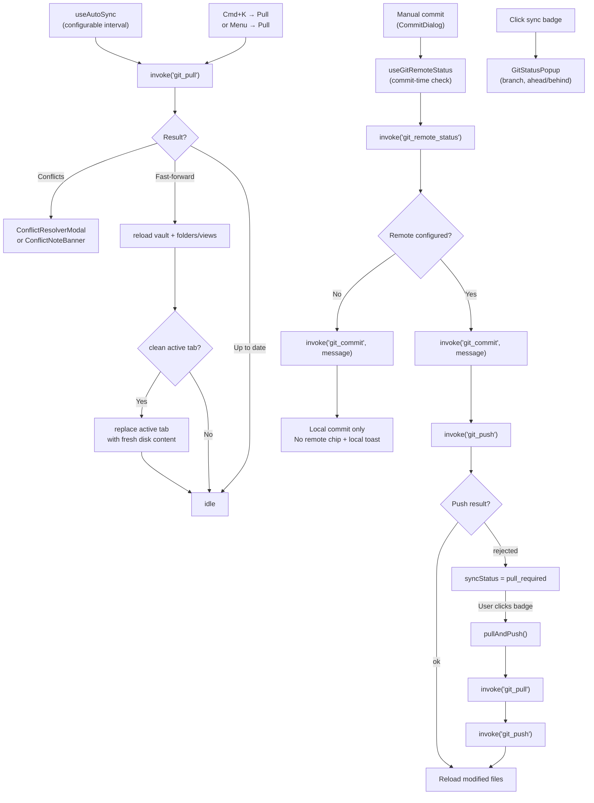
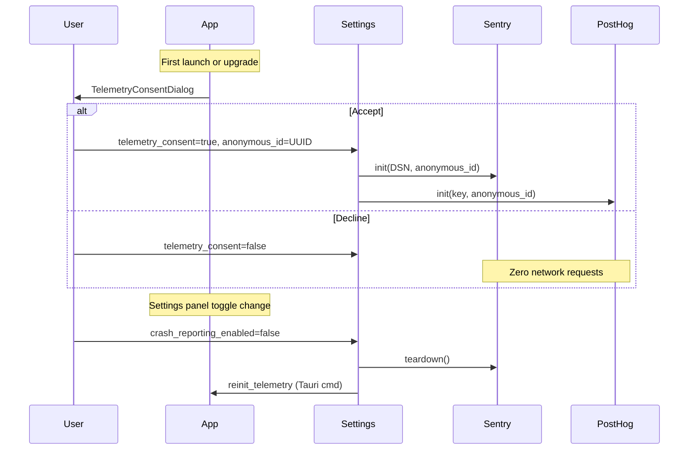

# Архитектура

Tolaria — десктопное приложение для управления личными знаниями и жизнью. Оно читает vault из markdown-файлов с YAML frontmatter и отображает их в четырёхпанельном интерфейсе, вдохновлённом Bear Notes.

## Принципы проектирования

### Файловая система — единственный источник истины

Vault — это папка с обычными markdown-файлами. Приложение никогда не владеет данными — оно лишь читает и пишет файлы. Кэш, состояние React и любое представление в памяти всегда производны от файловой системы и должны полностью восстанавливаться после удаления. Если есть сомнения — побеждает файл на диске.

### Convention over configuration

Tolaria — это приложение со своим мнением. Стандартные имена полей (`type:`, `status:`, `url:`, `Workspace:`, `belongs_to:`, `related_to:`, `has:`, `start_date:`, `end_date:`) имеют чётко определённые значения и автоматически вызывают конкретное поведение в UI — без какой-либо настройки. Дефолтные имена связей хранятся на диске в snake_case и приводятся к человекочитаемому виду в UI. Это не «соглашения *вместо* конфигурации»: пользователи могут переопределить дефолты через конфигурационные файлы внутри своего vault (например, `config/relations.md`, `config/semantic-properties.md`). Но дефолты работают сразу из коробки, и большинству пользователей вообще не нужно их трогать.

Этот принцип напрямую служит читаемости для AI: чем больше структуры идёт от общих соглашений, а не от индивидуальных пользовательских конфигураций, тем проще AI-агенту правильно понять и навигировать по vault — без необходимости специальных инструкций под каждую установку.

### Где хранить состояние: vault или настройки приложения

Когда решаете, где сохранять данные, спрашивайте: **«Захочет ли пользователь, чтобы это сопровождало его на всех установках Tolaria — других устройствах, будущих платформах (планшет, web)?»**

| Сопровождает vault | Остаётся с установкой |
|-------------------|-----------------------------|
| Иконка типа, цвет типа | Уровень зума редактора |
| Закреплённые свойства для типа | API-ключи (OpenAI, Google) |
| Переопределённые подписи в сайдбаре | Интервал автосинхронизации |
| Порядок отображения свойств | Размер / положение окна |
| Любая видимая пользователю настройка того, как организован или отображается контент | Любая машинно-специфичная настройка или учётные данные |

**Правило:** если информация — это *как структурирован или представлен контент* и пользователь ожидает, что она будет одинаковой везде, где он открывает свой vault, — храните её в vault (в frontmatter соответствующей заметки, используя соглашение `_field` с подчёркиванием для системных свойств). Если же это про *конкретную установку приложения* — храните в `~/.config/com.tolaria.app/settings.json` или в localStorage.

Примеры:
- ✅ Vault: `_pinned_properties` в заметке-типе (на каждом устройстве должны показываться одни и те же закреплённые свойства)
- ✅ Vault: `_icon: shapes` в заметке-типе (иконка — часть идентичности типа)
- ✅ Настройки приложения: `zoom: 1.3` (машинно-специфичное предпочтение)

### Никаких хардкодных исключений

Никакие имена полей, пути к папкам или vault-специфичные значения не должны быть захардкожены в исходниках приложения. Что может быть соглашением — должно быть соглашением. Что должно быть настраиваемым — должно жить в файле. Поля связей определяются динамически по тому, содержат ли значения `[[wikilinks]]`, — без хардкодных списков имён полей.

### AI-first граф знаний

Заметки — это не просто документы, а узлы в структурированном графе людей, проектов, событий, обязанностей и идей. Каждое проектное решение должно отвечать на вопрос: «Делает ли это граф знаний удобнее для навигации как человеку, *так и* AI?» Соглашения, понятные обоим, лучше тех, что понятны только одному.

### Три представления, один источник истины

Данные vault одновременно существуют в трёх формах:
1. **Файловая система** — `.md`-файлы на диске. Это единственный источник истины.
2. **Кэш** — `~/.laputa/cache/<hash>.json`, индекс для быстрого старта. Всегда восстанавливается из файловой системы.
3. **React state** — `VaultEntry[]` в памяти на время сессии. Всегда производное от кэша или файловой системы.

Эти представления никогда не должны постоянно расходиться. Если такое случилось — побеждает файловая система, а кэш и состояние пересобираются.



#### Правила владения

| Слой | Владелец | Пишет в | Читает из |
|-------|-------|-----------|------------|
| Файловая система | Tauri Rust-команды (`save_note_content`, `update_frontmatter` и т. д.) | Диск | — |
| Кэш | `scan_vault_cached()` в `vault/cache.rs` | `~/.laputa/cache/` | Файловая система + git diff |
| React state | `useVaultLoader` + `useEntryActions` + `useNoteActions` | `entries` в памяти | Кэш (при загрузке), файловая система (при reload) |

#### Инварианты

1. **Запись на диск в первую очередь**: все функции, изменяющие данные vault, должны записывать на диск (через Tauri IPC) *до* обновления React state. Это гарантирует, что при сбое записи на диск React state остаётся согласованным с тем, что реально на диске.
2. **Оптимистичный UI с откатом**: там, где важна отзывчивость (например, `persistOptimistic` в `useNoteCreation`), state может обновиться до подтверждения записи — но при ошибке колбэк должен откатить оптимистичное состояние.
3. **Никаких висящих обновлений state**: никогда не вызывайте `updateEntry()` до того, как соответствующий `handleUpdateFrontmatter()` или `handleDeleteProperty()` завершится. Три функции в `useEntryActions` (`handleCustomizeType`, `handleRenameSection`, `handleToggleTypeVisibility`) следуют этому правилу — сначала запись на диск, потом обновление state.
4. **Восстановление через перезагрузку**: если state когда-либо разойдётся с диском (краш, внешнее редактирование, гонка), `Reload Vault` (Cmd+K → "Reload Vault") инвалидирует кэш и делает полный rescan файловой системы через Tauri-команду `reload_vault`, заменяя весь React state. Команда `reload_vault_entry` может перечитать один файл.
5. **Кэш одноразовый**: команда `reload_vault` удаляет файл кэша перед rescan, гарантируя свежие данные. Кэш никогда не содержит данные, которых нет на файловой системе.

## Стек технологий

| Слой | Технология | Версия |
|-------|-----------|---------|
| Desktop shell | Tauri v2 | 2.10.0 |
| Frontend | React + TypeScript | React 19, TS 5.9 |
| Editor | BlockNote | 0.46.2 |
| Подсветка кодовых блоков | @blocknote/code-block | 0.46.2 |
| Raw editor | CodeMirror 6 | - |
| Стилизация | Tailwind CSS v4 + CSS variables | 4.1.18 |
| UI primitives | Radix UI + shadcn/ui | - |
| Иконки | Phosphor Icons + Lucide | - |
| Сборка | Vite | 7.3.1 |
| Бэкенд | Rust (edition 2021) | 1.77.2 |
| Парсинг frontmatter | gray_matter | 0.2 |
| AI (agent panel) | CLI agent adapters (Claude Code + Codex) | - |
| Поиск | Keyword (walkdir-based file scan) | - |
| MCP | @modelcontextprotocol/sdk | 1.0 |
| Тесты | Vitest (unit), Playwright (E2E/smoke), cargo test (Rust) | - |
| Менеджер пакетов | pnpm | - |

## Обзор системы



## Четырёхпанельный layout

```
┌────────┬─────────────┬─────────────────────────┬────────────┐
│Sidebar │ Note List   │ Editor                  │ Inspector  │
│(250px) │ (300px)     │ (flex-1)                │ (280px)    │
│        │ OR          │                         │ OR         │
│ All    │ Pulse View  │ [Breadcrumb Bar]        │ AI Chat    │
│ Changes│             │                         │ OR         │
│ Pulse  │ [Search]    │ # My Note               │ AI Agent   │
│ Inbox  │ [Sort/Filt] │                         │            │
│        │             │                         │ Context    │
│Projects│ Note 1      │ Content here...         │ Messages   │
│Experim.│ Note 2      │ (BlockNote or Raw)      │ Actions    │
│Respons.│ Note 3      │                         │ Input      │
│People  │ ...         │                         │            │
│Events  │             │                         │            │
│Topics  │             │                         │            │
├────────┴─────────────┴─────────────────────────┴────────────┤
│ StatusBar: v0.4.2 │ main │ Synced 2m ago │ Vault: ~/Laputa │
└──────────────────────────────────────────────────────────────┘
```

- **Sidebar** (150-400px, изменяемый размер): фильтры верхнего уровня (All Notes, Changes, Pulse), сворачиваемые группы секций по типам и отдельное дерево папок. Дерево папок показывает созданные пользователем папки плюс дефолтные папки vault, такие как `attachments/` и `views/`; скрытым остаётся только специальный каталог `type/`, потому что у типов заметок уже есть своя секция в сайдбаре. Дерево папок поддерживает создание и переименование инлайн, контекстное меню по правому клику для rename/delete и автоматически разворачивает родительские папки, когда текущий выбор или цель переименования вложены. Секции типов и строки папок также служат целями для drop'а заметок: бросок заметки на тип обновляет её frontmatter `type:`, а бросок на папку запускает тот же crash-safe move, что и flow в командной палитре. У каждого типа можно настроить свою иконку, цвет, сортировку и видимость через документ типа в `type/`.
- **Note List / Pulse View** (200-500px, изменяемый размер): когда выбрана группа секции, фильтр или сохранённое представление, показывает отфильтрованные заметки со сниппетами, датами модификации, индикаторами статуса и контекстными контролами для note list. Когда `selection.kind === 'entity'`, та же панель переходит в режим **Neighborhood**: исходная заметка закреплена сверху как обычная активная строка, исходящие группы связей рендерятся первыми, обратные/backlink-группы идут следом, пустые группы остаются видимы с `0`, а дубликаты между группами допустимы, когда несколько связей одновременно истинны. Обычный клик / `Enter` открывают сфокусированную заметку без замены текущего Neighborhood, тогда как Cmd/Ctrl-клик и Cmd/Ctrl-`Enter` поворачивают панель в Neighborhood выбранной заметки. Сохранённые представления переиспользуют те же контролы сортировки и видимых колонок, что и встроенные списки, и эти изменения сохраняются обратно в `.yml`-определение представления (`sort`, `listPropertiesDisplay`). Когда активен фильтр Pulse, панель показывает `PulseView` — хронологическую ленту git-активности, сгруппированную по дням.
- **Editor** (flex, занимает оставшееся пространство): одновременно открыта одна заметка (никаких вкладок — см. ADR-0003). Панель breadcrumb со счётчиком слов, BlockNote rich text editor с поддержкой wikilink, контролы форматирования, безопасные для markdown, и подсветка fenced code-блоков на основе схемы через `@blocknote/code-block`. Можно переключиться на diff-вид (модифицированные файлы) или на raw CodeMirror. Декомпозирован на `Editor` (оркестратор), `EditorContent`, `EditorRightPanel`, `SingleEditorView`, с хуками `useDiffMode`, `useEditorFocus` и `useEditorSave`, плюс пару `useRawMode`/`RawEditorView` для редактирования markdown-источника. И ввод в богатом BlockNote, и в raw CodeMirror прогоняют набранные `->`, `<-` и `<->` через общий резолвер `src/utils/arrowLigatures.ts`, чтобы лигатуры стрелок оставались согласованными при переключении режимов, а экранированные ASCII-последовательности — литералами. Историю навигации (Cmd+[/]) заменяет вкладки.
- **Inspector / AI Agent** (200-500px или 40px в свёрнутом виде): переключается между Inspector (frontmatter, связи, экземпляры, backlinks, история git) и панелью AI Agent (выбранный CLI-агент с выполнением инструментов). Иконка Sparkle в breadcrumb-баре переключает между ними. Параметр `icon` для заметки — это рекомендуемое свойство Inspector, а действие "Set Note Icon" в командной палитре открывает это поле напрямую. При просмотре заметки-типа Inspector показывает секцию **Instances** со списком всех заметок этого типа (отсортированных по modified_at desc, с лимитом 50).

Панели разделены компонентами `ResizeHandle`, поддерживающими изменение размера перетаскиванием.

Главное окно Tauri выводит свою минимальную ширину из видимых панелей, а не из единого фиксированного значения. `useMainWindowSizeConstraints` принимает оболочку только с редактором за базовую отметку 480px, прибавляет надбавки для sidebar / note-list / развёрнутого inspector и вызывает нативную команду `update_current_window_min_size` всякий раз, когда меняется режим вида или видимость inspector. Та же нативная команда также увеличивает текущее окно обратно при восстановлении более широкой комбинации панелей, а окна заметок обходят этот путь и сохраняют свой выделенный начальный размер 800×700.

Linux использует кастомный chrome окна, отрисованный на React, вместо нативной menu bar Tauri. `setup_linux_window_chrome()` отключает server-side decorations на главном окне, `openNoteInNewWindow()` делает то же самое для отделённых окон заметок, а `LinuxTitlebar`/`LinuxMenuButton` направляют и контролы окна, и действия меню обратно через тот же общий командный pipeline, что macOS использует для нативных кликов меню.
Когда Tolaria запускается из Linux AppImage, `run()` также инжектит `WEBKIT_DISABLE_DMABUF_RENDERER=1`, если пользователь сам не задал эту переменную. Это держит обходной путь в рамках запусков WebKitGTK, упакованных через AppImage и склонных к крашам DMA-BUF на Fedora/Wayland, не меняя поведения нативных пакетных установок.

## Multi-Window (окна заметок)

Заметки можно открывать в отдельных окнах Tauri для сосредоточенного редактирования. Вторичные окна показывают только панель редактора (без sidebar, без note list).

**Триггеры:**
- `Cmd+Shift+Click` на любой заметке в note list или sidebar
- `Cmd+K` → "Open in New Window" (командная палитра, требует активной заметки)
- Шорткат `Cmd+Shift+O`
- Note → "Open in New Window" в menu bar

**Архитектура:**
- `openNoteInNewWindow()` (`src/utils/openNoteWindow.ts`) создаёт новый `WebviewWindow` через JS API Tauri v2 с query-параметрами URL (`?window=note&path=...&vault=...&title=...`)
- `main.tsx` при старте проверяет `isNoteWindow()` и роутит между `App` (главное окно) и `NoteWindow` (вторичное окно)
- `NoteWindow` (`src/NoteWindow.tsx`) — минимальная оболочка, которая загружает vault entries, получает содержимое заметки, применяет тему и рендерит один экземпляр `Editor`
- У каждого окна есть свой автосохраняющий `useEditorSaveWithLinks` (тот же 500ms debounce, та же Rust-команда `save_note_content`), а ввод в raw editor также выводит во рендерере состояние `VaultEntry`, опирающееся на frontmatter, чтобы Inspector и поверхности note-list реагировали мгновенно, не ожидая полной перезагрузки
- Вторичные окна имеют размер 800×700; macOS сохраняет overlay title bar, а Linux монтирует общий React-titlebar на окнах без декораций
- Конфиг capabilities (`src-tauri/capabilities/default.json`) выдаёт права как лейблу окон `main`, так и `note-*`

## AI System

### AI Agent (AiPanel)

Полный режим агента — спавнит выбранный локальный CLI-агент как подпроцесс с доступом к инструментам и интеграцией vault через MCP.

1. **Frontend** (`AiPanel` + `useCliAiAgent` + `aiAgents.ts`) — стримящийся UI с блоками рассуждений, карточками действий инструментов, отображением ответов, онбордингом и выбором агента по умолчанию
2. **Backend** (`ai_agents.rs`) — нормализует доступность агентов и стриминг, диспатчит на адаптеры конкретных агентов
3. **Адаптеры агентов** — Claude Code по-прежнему использует `claude_cli.rs`; Codex запускается через `codex exec --json` с обычными дефолтами approval / sandbox от CLI
4. **Интеграция с MCP** — Claude получает путь к сгенерированному конфигу MCP, тогда как Codex получает тот же MCP-сервер Tolaria через временные оверрайды конфига `-c mcp_servers.tolaria.*`

Доступность Claude Code намеренно не зависит только от унаследованного `PATH` десктоп-приложения. Детектор проверяет путь текущего процесса, login-shell пользователя и поддерживаемые локальные / toolchain места установки, такие как нативный `~/.local/bin`, локальный `~/.claude/local`, шим Mise/asdf, npm-global и пути Homebrew, чтобы первый запуск работал на свежих установках macOS.

#### Поток событий агента



#### Детекция файловых операций

Когда агент пишет или редактирует файлы vault, `useCliAiAgent` детектит это из нормализованных входов инструментов и вызывает колбэки `onFileCreated` или `onFileModified`, чтобы запустить перезагрузку vault.

### Сборка контекста

Панель агента (`ai-context.ts`) собирает структурированный JSON-снимок из активной заметки и связанных entries:

```json
{
  "activeNote": { "path", "title", "type", "frontmatter", "content" },
  "linkedNotes": [{ "path", "title", "content" }],
  "openTabs": [{ "title", "snippet" }],
  "vaultMetadata": { "noteTypes", "stats", "filter" },
  "references": [{ "title", "path", "type" }]
}
```

Бюджет токенов: 60% от 180k лимита контекста (~108k токенов максимум). Активная заметка получает приоритет, потом связанные заметки, потом усечение.

### Аутентификация

Каждый CLI-агент аутентифицируется сам, вне Tolaria. Claude Code использует свой существующий CLI-логин; Codex показывает дружелюбный prompt запустить `codex login`, когда нужно. Tolaria не хранит API-ключи провайдеров моделей в настройках приложения.

## MCP Server

MCP-сервер (`mcp-server/`) экспонирует операции с vault как инструменты для AI-ассистентов (Claude Code, Cursor или любого MCP-совместимого клиента).

### Поверхность инструментов (14 инструментов)

| Инструмент | Параметры | Описание |
|------|--------|-------------|
| `open_note` | `path` | Открыть и прочитать заметку по относительному пути |
| `read_note` | `path` | Прочитать содержимое заметки (алиас для `open_note`) |
| `create_note` | `path, title, [type]` | Создать новую заметку с заголовком и опциональным типом во frontmatter |
| `search_notes` | `query, [limit]` | Поиск заметок по подстроке заголовка или содержимого |
| `append_to_note` | `path, text` | Добавить текст в конец существующей заметки |
| `edit_note_frontmatter` | `path, patch` | Смерджить key-value патч во frontmatter YAML |
| `delete_note` | `path` | Удалить файл заметки из vault |
| `link_notes` | `source_path, property, target_title` | Добавить цель в array-свойство во frontmatter |
| `list_notes` | `[type_filter], [sort]` | Перечислить все заметки, опционально с фильтром по типу |
| `vault_context` | — | Получить сводку vault: типы сущностей + 20 недавних заметок + configFiles |
| `ui_open_note` | `path` | Открыть заметку в редакторе UI Tolaria |
| `ui_open_tab` | `path` | Открыть заметку в новой вкладке UI |
| `ui_highlight` | `element, [path]` | Подсветить элемент UI (editor, tab, properties, notelist) |
| `ui_set_filter` | `type` | Установить фильтр сайдбара на конкретный тип |

### Транспорты

- **stdio** — стандартный MCP-транспорт для Claude Code / Cursor (`node mcp-server/index.js`)
- **WebSocket** — живой мост для интеграции с приложением Tolaria:
  - Порт **9710**: tool bridge — AI/Claude-клиенты вызывают здесь инструменты vault
  - Порт **9711**: UI bridge — фронтенд слушает броадкасты UI-действий от MCP-инструментов

### Явная настройка внешних инструментов

Tolaria может зарегистрировать себя как MCP-сервер в:
- `~/.claude.json` и `~/.claude/mcp.json` (совместимость с Claude Code для текущего CLI и legacy-конфигов с MCP-файлом)
- `~/.cursor/mcp.json` (Cursor)

Эта настройка инициируется пользователем через flow в статус-баре / командной палитре, а не как побочный эффект старта. Регистрация неразрушающая (аддитивная, сохраняет другие серверы), использует семантику `upsert` и обратима через удаление записи Tolaria. Хук `useMcpStatus` отслеживает, явно ли подключён активный vault (`checking | installed | not_installed`).

### Архитектура



### WebSocket Bridge



**Протокол tool bridge** (порт 9710):
- Запрос: `{ "id": "req-1", "tool": "search_notes", "args": { "query": "test" } }`
- Ответ: `{ "id": "req-1", "result": { ... } }`

**Протокол UI bridge** (порт 9711):
- Broadcast: `{ "type": "ui_action", "action": "open_note", "path": "..." }`
- Хук `useAiActivity` принимает их и применяет (highlight с фидбэком 800ms, открытие заметки, установка фильтра и т. д.)

### Rust MCP-модуль

`src-tauri/src/mcp.rs` управляет жизненным циклом MCP-сервера:

| Функция | Назначение |
|----------|---------|
| `spawn_ws_bridge(vault_path)` | Спавнит `ws-bridge.js` как дочерний процесс с env VAULT_PATH |
| `register_mcp(vault_path)` | Записывает запись Tolaria в конфиги MCP Claude Code и Cursor по явному запросу пользователя |
| `remove_mcp()` | Удаляет запись Tolaria MCP из конфигов Claude Code и Cursor |
| `upsert_mcp_config(path, entry)` | Атомарное обновление файла конфига (создание/мердж, сохраняет другие записи) |

Обёртка `WsBridgeChild` в `lib.rs` гарантирует, что процесс bridge будет убит при выходе из приложения через хендлер `RunEvent::Exit`. Тот же десктоп-слой теперь держит asset protocol Tauri ограниченным активным vault, а не всеми путями файловой системы.

## Поиск

Поиск keyword-based, использует `walkdir` для сканирования всех `.md`-файлов в директории vault. Никаких внешних бинарников или шага индексации не требуется.

- Сопоставляет запрос с заголовками файлов и содержимым (без учёта регистра)
- Оценивает результаты: совпадения по заголовку ранжируются выше, чем только по содержимому
- Извлекает контекстные сниппеты вокруг первого совпадения
- Пропускает скрытые файлы

Tauri-команда `search_vault` запускает скан в blocking Tokio task и возвращает результаты, отсортированные по релевантности.

## Vault Cache System

Кэш vault (`src-tauri/src/vault/cache.rs`) ускоряет сканирование vault через инкрементальные обновления на основе git.

### Файл кэша

`~/.laputa/cache/<vault-hash>.json` — хранится за пределами директории vault, чтобы никогда не загрязнять git-репо пользователя. Путь vault хэшируется (через `DefaultHasher`), чтобы получить детерминированное имя файла. Хранит: путь vault, hash коммита git HEAD, все объекты VaultEntry. Версия: v13 (поднимается при изменениях полей VaultEntry, чтобы форсировать полный rescan). Замена кэша делается best-effort: Tolaria пишет временный файл, fsync'ает его и переименовывает на место только после того, как кратковременный writer-lock плюс проверка fingerprint на диске подтвердят, что другое окно/процесс ещё не обновили кэш. Сбои логируются, и приложение откатывается к пересборке из файловой системы.

`<vault>/.tolaria-rename-txn/` — скрытая, исключённая из сканирования staging-директория для crash-safe переименований заметок. Tolaria хранит здесь временные backup-файлы плюс по одному манифесту на каждое незавершённое переименование. При следующем сканировании vault незавершённые транзакции восстанавливаются до того, как entries будут перечислены, чтобы пользователь не увидел отсутствующую заметку или видимый дубликат после краша.

### Три стратегии кэширования



## Стилизация

Приложение использует встроенные внутренние светлую и тёмную темы, принадлежащие самому приложению (см. [ADR-0081](adr/0081-internal-light-dark-theme-runtime.md)). Это не та старая система тем, авторизованных vault, из ADR-0013: пользователи выбирают режим, но темами владеет приложение.

1. **Глобальные CSS-переменные** (`src/index.css`): семантические цвета приложения, бордеры, поверхности и состояния взаимодействия. Связаны с Tailwind v4 через `@theme inline`.
2. **Тема редактора** (`src/theme.json`): типографика, специфичная для BlockNote. Сплющивается в CSS-переменные хуком `useEditorTheme`; цвета редактора резолвятся через те же семантические переменные приложения.
3. **Theme runtime**: применяет `data-theme` и shadcn-совместимый класс `.dark` до того, как React-консьюмеры рендерятся, с зеркалом в localStorage, чтобы избежать вспышки на старте при выбранном тёмном режиме.

## Управление vault

### Список vault'ов

Сохраняется в `~/.config/com.tolaria.app/vaults.json` (читает legacy `com.laputa.app` при апгрейде):
```json
{
  "vaults": [{ "label": "My Vault", "path": "/path/to/vault" }],
  "active_vault": "/path/to/vault",
  "hidden_defaults": []
}
```

Управляется хуком `useVaultSwitcher`. Переключение vault'ов сбрасывает sidebar и очищает активную заметку.

### Конфиг vault

Per-vault UI-настройки, хранящиеся локально для каждого пути vault (сейчас в browser/Tauri localStorage, не синкаются через git):
- `zoom`: float уровень зума (0.8–1.5)
- `view_mode`: "all" | "editor-list" | "editor-only"
- `editor_mode`: "raw" | "preview" (сохраняется при переключении заметок и сессий)
- `tag_colors`, `status_colors`: переопределения цветов
- `property_display_modes`: предпочтения отображения свойств
- `inbox.noteListProperties`: опциональное переопределение property-чипов в note list только для Inbox
- `allNotes.noteListProperties`: опциональное переопределение property-чипов в note list только для All Notes
- `inbox.explicitOrganization`: при `false` скрывает Inbox и тумблер organized, чтобы vault вёл себя как обычная коллекция заметок

### Getting Started Vault

При первом запуске `useOnboarding` проверяет, существует ли дефолтный vault. Если нет — показывает `WelcomeScreen` с тремя опциями:
- **Create a new vault** → создаёт пустой git-репо в выбранной пользователем папке
- **Open an existing folder** → системный file picker
- **Get started with a template** → выбор родительской папки, затем вызов `create_getting_started_vault()` с производным дочерним путём `.../Getting Started`, чтобы клонированный vault сразу открывался в корне заполненного репо

Если открытая папка ещё не git-репо, `init_git_repo` запускает `git init`, обеспечивает дефолтный `.gitignore` от Tolaria, стейджит vault и пишет начальный коммит `Initial vault setup`. Этот управляемый приложением setup-коммит явно отключает подпись коммита для одной команды, чтобы унаследованные глобальные или локальные предпочтения `commit.gpgsign` не могли застопорить онбординг при отсутствующем или неправильно настроенном GPG. Последующие вызовы `git_commit` сначала уважают конфигурацию подписи пользователя, а потом один раз ретраят тот же управляемый приложением коммит с `commit.gpgsign=false`, только если Git сообщает об ошибке signing-helper, — так рабочие настройки подписи GPG/SSH продолжают подписывать, а сломанные настройки GPG не приводят к повторяющимся непрозрачным ошибкам коммита.

Как только vault готов, `useAiAgentsOnboarding` может показать одноразовый `AiAgentsOnboardingPrompt`. Этот промпт читает `useAiAgentsStatus`, чтобы при первом запуске показать, установлены ли Claude Code и Codex, предлагает ссылки на установку для каждого агента, когда они отсутствуют, и хранит локальное dismissal, чтобы не повторять промпт при каждом запуске.

`useGettingStartedClone` переиспользует ту же семантику родительской папки для действия клонирования из статус-бара / командной палитры, а `Toast` рендерится через гейт онбординга AI-агентов, чтобы разрешённый путь назначения оставался видимым сразу после успешного клонирования.

Стартовый контент больше не живёт в репо приложения. `src-tauri/src/vault/getting_started.rs` хранит публичный URL стартового репо (`refactoringhq/tolaria-getting-started`), делегирует клонирование git-бэкенду, затем нормализует управляемое Tolaria root-руководство и каркас типов (`AGENTS.md`, `CLAUDE.md`, `type.md`, `note.md`), чтобы свежие starter-vault'ы подтягивали текущие дефолты, даже когда удалённое стартовое репо ещё несёт legacy-копию или более старый pre-`type:` `is_a`-эра шаблон. `AGENTS.md` остаётся каноническим файлом руководства vault; `CLAUDE.md` — это compatibility-шим, который импортирует его для Claude Code без дублирования инструкций, и Tolaria сидит его как организованную `Note`, чтобы он не мешался в свежем vault. Хелпер клонирования по-прежнему принимает legacy-оверрайд переменной окружения `LAPUTA_GETTING_STARTED_REPO_URL`, чтобы старая автоматизация могла продолжать перенаправлять источник стартера на время перехода.

После завершения клонирования Tolaria удаляет каждый сконфигурированный git remote из нового стартового vault. Поэтому Getting Started vaults открываются как локальные по умолчанию, и пользователи позже подключают remote через явный flow Add Remote.

### Remote Clone & Auth Model

Tolaria больше не реализует provider-specific OAuth или API удалённых репозиториев. Вся работа с remote git идёт через существующую системную конфигурацию git пользователя.

**Flow:**
1. Пользователь открывает `CloneVaultModal` из онбординга или меню vault
2. Пользователь вставляет любой git URL и выбирает локальное место назначения
3. Tauri-команда `clone_git_repo()` запускает `git clone` внутри blocking Tokio task, чтобы окно Tauri оставалось отзывчивым во время медленных или падающих clone'ов
4. `git_push()` / `git_pull()` продолжают использовать тот же системный путь git
5. Команды клонирования отключают интерактивные prompt'ы terminal / askpass и пробрасывают git-ошибку обратно в UI, вместо того чтобы зависать в ожидании ввода

**Модель аутентификации:**
- SSH-ключи, Git Credential Manager, хелперы macOS Keychain, `gh auth` и другие git-хелперы работают без app-specific настройки
- В настройках Tolaria не хранятся provider-токены
- Тот же flow работает для GitHub, GitLab, Bitbucket, Gitea и self-hosted remote'ов

## Pulse View

`PulseView` — это лента git-активности, которая заменяет NoteList, когда выбран фильтр Pulse.

- Группирует коммиты по дням ("Today", "Yesterday" или полная дата)
- Показывает сообщение коммита, короткий хэш, timestamp и изменённые файлы
- У файлов есть иконки статуса (added/modified/deleted), и они кликабельны для открытия в редакторе
- Ссылается на коммиты GitHub, когда `githubUrl` доступен
- Бесконечная пагинация скроллом (20 коммитов на страницу) через Intersection Observer

Бэкенд: Tauri-команда `get_vault_pulse` парсит `git log` с `--name-status`.

## Поток данных

### Последовательность старта



### Поток автосохранения



### Поток git-синхронизации



`useGitRemoteStatus` перепроверяет `git_remote_status`, когда открывается диалог коммита, и снова прямо перед submit. Если `hasRemote` равен false, Tolaria держит flow локальным: статус-бар показывает нейтральный чип `No remote`, текст диалога переключается с "Commit & Push" на "Commit", и вызов `git_push` не делается.

То же самое локальное состояние включает явный flow Add Remote. `AddRemoteModal` доступен из чипа `No remote` и командной палитры. Бэкенд-команда `git_add_remote` добавляет `origin`, фетчит его, отказывается от несовместимых историй и включает tracking только после того, как успешно пройдут безопасный push или fast-forward-совместимая проверка.

`useCommitFlow` также экспонирует `runAutomaticCheckpoint()` — путь коммита без диалога, разделяемый между AutoGit и кнопкой Commit в нижней панели. `useAutoGit` отслеживает последнюю активность в редакторе плюс состояние focus/visibility приложения, и когда vault git-backed, все save'ы сброшены и не осталось несохранённых правок — он триггерит тот же детерминированный путь сообщения коммита `Updated N note(s)` / `Updated N file(s)` после сконфигурированных порогов idle или inactive. Быстрое действие в нижней панели переиспользует этот checkpoint flow после принудительного save'а, поэтому ручные быстрые коммиты и плановые коммиты AutoGit остаются согласованными по генерации сообщения и поведению push.

#### Состояния синхронизации

| Состояние | Индикатор | Цвет | Триггер |
|-------|-----------|-------|---------|
| `idle` | Synced / Synced Xm ago | green | Успешная синхронизация |
| `syncing` | Syncing... | blue | Pull/push в процессе |
| `pull_required` | Pull required | orange | Push отклонён (расхождение) |
| `conflict` | Conflict | orange | Обнаружены merge-конфликты |
| `error` | Sync failed | grey | Сетевая/auth-ошибка |

## Структура модуля Vault

Бэкенд vault (`src-tauri/src/vault/`) разделён на сфокусированные подмодули:

| Файл | Назначение |
|------|---------|
| `mod.rs` | Основные типы (`VaultEntry`, `Frontmatter`), `parse_md_file`, `scan_vault`, извлечение связей/ссылок |
| `parsing.rs` | Обработка текста: извлечение сниппета, очистка markdown, парсинг ISO-дат, `extract_title` (H1 → legacy frontmatter → filename), `slug_to_title` |
| `title_sync.rs` | Legacy-хелпер для синка filename → frontmatter `title`; больше не используется в обычном flow открытия заметки |
| `cache.rs` | Инкрементальное кэширование vault на основе git (`scan_vault_cached`), git-хелперы |
| `filename_rules.rs` | Кросс-платформенная валидация имён файлов заметок, имён папок и filenames кастомных представлений |
| `rename.rs` | `rename_note` / `rename_note_filename` / `move_note_to_folder` — стейджит crash-safe перемещения файлов, обновляет frontmatter `title` при необходимости, восстанавливает незавершённые транзакции переименования и сообщает о сбоях переписывания backlinks |
| `image.rs` | `save_image` / `copy_image_to_vault` — сохранение image-вложений редактора с санированными filenames |
| `migration.rs` | `flatten_vault`, `vault_health_check`, `migrate_is_a_to_type` |
| `config_seed.rs` | Поддерживает AI-руководство vault (`AGENTS.md` + `CLAUDE.md`-шим), мигрирует legacy `config/agents.md` и чинит отсутствующий root-каркас типов вроде `type.md` и `note.md` |
| `getting_started.rs` | Клонирует и нормализует публичный стартовый vault Getting Started |

## Rust Backend Modules

| Модуль | Назначение |
|--------|---------|
| `vault/` | Сканирование vault, кэширование, парсинг, переименование, изображения, миграция |
| `frontmatter/` | Чтение/запись YAML frontmatter (`mod.rs`, `yaml.rs`, `ops.rs`) |
| `git/` | Git-операции (`commit.rs`, `status.rs`, `history.rs`, `conflict.rs`, `remote.rs`, `pulse.rs`, `clone.rs`, `connect.rs`) |
| `search.rs` | Keyword-поиск — скан файлов vault на основе walkdir |
| `ai_agents.rs` | Общая детекция CLI-агентов, нормализация стрима и dispatch адаптеров |
| `claude_cli.rs` | Спавн подпроцесса Claude Code + парсинг NDJSON-стрима |
| `mcp.rs` | Спавн MCP-сервера + явная регистрация/удаление конфига |
| `commands/` | Хендлеры Tauri-команд (разбиты на подмодули) |
| `settings.rs` | Persistence настроек приложения |
| `vault_config.rs` | Per-vault UI-конфиг |
| `vault_list.rs` | Persistence списка vault'ов |
| `menu.rs` | Определения нативного desktop-меню и ID команд (не монтируется на Linux) |

## Команды Tauri IPC

### Vault Operations

| Команда | Описание |
|---------|-------------|
| `list_vault` | Сканирование vault (cached) → `Vec<VaultEntry>` |
| `get_note_content` | Чтение содержимого файла заметки |
| `save_note_content` | Запись содержимого заметки на диск |
| `delete_note` | Безвозвратное удаление заметки с диска (с confirm-диалогом) |
| `rename_note` | Crash-safe переименование заметки + обновление frontmatter `title` + cross-vault wikilinks + счётчики неуспешных backlinks |
| `move_note_to_folder` | Crash-safe перемещение в папку, сохраняющее filename, перезагружает перемещённую заметку и переписывает path-based wikilinks |
| `create_vault_folder` | Создать папку относительно корня активного vault |
| `rename_vault_folder` | Переименовать папку относительно корня активного vault и вернуть старый/новый относительные пути |
| `delete_vault_folder` | Безвозвратное удаление поддерева папки относительно корня активного vault |
| `sync_note_title` | Legacy-хелпер: переписывает frontmatter `title` из filename → `bool` (modified); не используется в обычном flow открытия заметки |
| `batch_archive_notes` | Архивирование нескольких заметок |
| `batch_delete_notes` | Безвозвратное удаление заметок с диска |
| `reload_vault` | Синхронизация asset scope активного vault, инвалидация кэша и полный rescan из файловой системы → `Vec<VaultEntry>` |
| `reload_vault_entry` | Перечитать один файл с диска → `VaultEntry` |
| `check_vault_exists` | Проверить, существует ли путь vault |
| `create_empty_vault` | Создать git-backed vault, затем засидить дефолты `AGENTS.md`, `CLAUDE.md`, `type.md` и `note.md` в корне |
| `create_getting_started_vault` | Клонировать публичный Getting Started vault, обновить управляемые Tolaria дефолты руководства/конфига и держать клонированное репо чистым |
| `get_vault_ai_guidance_status` | Сообщить, являются ли `AGENTS.md` и `CLAUDE.md`-шим управляемыми, отсутствующими, сломанными или кастомными |
| `restore_vault_ai_guidance` | Восстановить любые отсутствующие/сломанные файлы руководства, управляемые Tolaria, не перезаписывая кастомные |

### Frontmatter

| Команда | Описание |
|---------|-------------|
| `update_frontmatter` | Обновить свойство frontmatter |
| `delete_frontmatter_property` | Удалить свойство frontmatter |

### Git

| Команда | Описание |
|---------|-------------|
| `init_git_repo` | Инициализировать локальное репо, добавить дефолтный `.gitignore` и создать неподписанный setup-коммит |
| `git_commit` | Stage all + commit |
| `git_pull` | Pull из remote |
| `git_push` | Push в remote |
| `git_remote_status` | Получить имя ветки + счётчики ahead/behind |
| `git_add_remote` | Подключить локальный vault к совместимому remote и начать его tracking |
| `git_resolve_conflict` | Разрешить merge-конфликт |
| `git_commit_conflict_resolution` | Закоммитить разрешение конфликта |
| `get_file_history` | Последние N коммитов для файла |
| `get_modified_files` | `git status`, отфильтрованный до .md |
| `get_file_diff` | Унифицированный diff для файла |
| `get_file_diff_at_commit` | Diff на конкретном коммите |
| `get_conflict_files` | Список конфликтующих файлов |
| `get_conflict_mode` | Получить режим разрешения конфликта |
| `get_vault_pulse` | Лента git-активности (с пагинацией) |
| `get_last_commit_info` | Метаданные последнего коммита |
| `clone_repo` | Клонировать удалённый репозиторий в локальную папку через системный git |

### Поиск

| Команда | Описание |
|---------|-------------|
| `search_vault` | Keyword-поиск по файлам vault |

### Vault Maintenance

| Команда | Описание |
|---------|-------------|
| `get_vault_settings` | Чтение `.laputa/settings.json` |
| `save_vault_settings` | Запись настроек vault |
| `repair_vault` | Уплощить структуру vault, мигрировать legacy-frontmatter, восстановить дефолты root config/type, включая `note.md` |

### AI & MCP

| Команда | Описание |
|---------|-------------|
| `stream_claude_chat` | Claude CLI chat mode (streaming) |
| `stream_claude_agent` | Claude CLI agent mode (streaming + tools) |
| `check_claude_cli` | Проверить, доступен ли Claude CLI |
| `get_ai_agents_status` | Проверить доступность Claude Code + Codex |
| `stream_ai_agent` | Стримить выбранного CLI-агента через нормализованный event-слой |
| `register_mcp_tools` | Зарегистрировать MCP в конфиге Claude/Cursor для активного vault |
| `remove_mcp_tools` | Удалить MCP-запись Tolaria из конфига Claude/Cursor |
| `check_mcp_status` | Проверить, явно ли активный vault зарегистрирован в конфиге Claude/Cursor |

Десктопный MCP WebSocket bridge намеренно сделан local-only. `mcp-server/ws-bridge.js` биндит оба порта моста на loopback, отклоняет non-loopback клиентов, принимает browser/Tauri origins только на UI bridge и отклоняет browser-origin запросы на tool bridge, чтобы удалённые страницы не могли напрямую дёргать инструменты vault.

### Settings & Config

| Команда | Описание |
|---------|-------------|
| `get_settings` | Загрузить настройки приложения |
| `save_settings` | Сохранить настройки приложения |
| `load_vault_list` | Загрузить список vault'ов |
| `save_vault_list` | Сохранить список vault'ов |
| `get_vault_config` | Загрузить per-vault UI-конфиг |
| `save_vault_config` | Сохранить per-vault UI-конфиг |
| `get_default_vault_path` | Получить дефолтный путь vault |
| `get_build_number` | Получить build number приложения |
| `save_image` | Сохранить base64-изображение в `attachments/` и обновить asset scope активного vault |
| `copy_image_to_vault` | Скопировать файл изображения в `attachments/` и обновить asset scope активного vault |
| `update_menu_state` | Обновить чекмарки нативного меню и состояние enabled/disabled для зависящих от выбора действий |
| `trigger_menu_command` | Эмитить ID команды нативного меню для детерминированного QA шорткатов |
| `update_current_window_min_size` | Обновить минимальный размер активного окна Tauri и опционально увеличить его, чтобы вместить восстановленные панели |

`get_build_number` питает label в нижнем статус-баре. Он сохраняет legacy-метки билдов по дате `bNNN`, рендерит локальные сборки `0.1.0` / `0.0.0` как `dev`, форматирует календарные alpha-сборки как `Alpha YYYY.M.D.N`, обрезает любой календарный суффикс `-stable.N` обратно до `YYYY.M.D` и держит legacy-релизы semver читаемыми вместо отката к `?`.

## Mock Layer

При запуске вне Tauri (браузер на `localhost:5173`) `src/mock-tauri.ts` обеспечивает прозрачный mock-слой:

```typescript
if (isTauri()) {
  result = await invoke<T>('command_name', { args })
} else {
  result = await mockInvoke<T>('command_name', { args })
}
```

Mock-слой включает примеры entries для всех типов сущностей, полное markdown-содержимое с реалистичным frontmatter, mock git-историю, mock AI-ответы и mock pulse-коммиты. Он также отслеживает per-vault remote-состояние, поэтому browser-mode Getting Started и flow пустого vault теперь ведут себя как десктоп-приложение: локальные до тех пор, пока не пройдёт `git_add_remote`.

Browser smoke-тесты также могут переопределить `window.__mockHandlers` до того, как приложение стартует. AutoGit smoke bridge использует этот путь напрямую для seeded save'ов, чтобы mock'нутое git-dirty-состояние оставалось синхронизированным даже когда опциональный browser vault API обслуживает содержимое заметки.

## Управление состоянием

Никакого Redux или глобального context. Состояние живёт в корневом `App.tsx` и кастомных хуках:

| Владелец state | State | Назначение |
|-------------|-------|---------|
| `App.tsx` | `selection`, ширины панелей, видимость диалогов, toast, view mode | UI-состояние |
| `useVaultLoader` | `entries`, `allContent`, `modifiedFiles` | Данные vault |
| `useNoteActions` | `tabs`, `activeTabPath` | Композирует `useNoteCreation` + `useNoteRename` + `frontmatterOps` |
| `useNoteCreation` | — | Создание заметок/типов с оптимистичной persistence |
| `useNoteRename` | — | Переименование заметок и перемещение в папки с обновлением wikilink |
| `useNoteRetargeting` | — | Общая логика retargeting заметок для drag/drop и действий командной палитры |
| `frontmatterOps` | — (чистые функции) | Frontmatter CRUD: маппинг key→VaultEntry, mock/Tauri dispatch |
| `useTabManagement` | История навигации, переключение заметок | Жизненный цикл навигации по заметкам |
| `useVaultSwitcher` | `vaultPath`, `extraVaults` | Переключение vault'ов |
| `useTheme` | CSS-переменные темы редактора и мост theme-mode | Типографика редактора и runtime темы приложения |
| `useCliAiAgent` | `messages`, `status`, действия инструментов | Разговор с выбранным AI-агентом |
| `useAutoSync` | Интервал sync, состояние pull/push | Git auto-sync |
| `useAutoGit` | Timestamp последней активности, триггеры idle/inactive checkpoint | Автоматические checkpoints коммитов/пушей |
| `useCommitFlow` | Состояние commit-диалога, общий runner manual/automatic checkpoint | Оркестрация git commit/push |
| `useGitRemoteStatus` | `remoteStatus`, `refreshRemoteStatus()` | On-demand детекция remote для UI коммита |
| `useUnifiedSearch` | Query, results, состояние loading | Keyword-поиск |
| `useSettings` | Настройки приложения (telemetry, release channel, theme mode, интервал auto-sync, пороги AutoGit, дефолтный AI-агент) | Persistent-настройки |
| `useVaultConfig` | Per-vault UI-предпочтения | Vault-специфичный конфиг |
| `appCommandDispatcher` | Канонические ID шорткатов/команд меню | Общий путь выполнения для команд из renderer и нативного меню |

Данные текут однонаправленно: `App` передаёт данные и колбэки как props в дочерние компоненты. Никакой child-to-child коммуникации — всё идёт через `App`.

## Клавиатурные шорткаты

| Шорткат | Действие |
|----------|--------|
| Cmd+K | Открыть командную палитру |
| Cmd+P / Cmd+O | Открыть quick open palette |
| Cmd+N | Создать новую заметку |
| Cmd+S | Сохранить текущую заметку |
| Cmd+[ / Cmd+] | Навигация назад / вперёд (заменяет вкладки) |
| Cmd+Z / Cmd+Shift+Z | Undo / Redo |
| Cmd+1–9 | Переключиться на вкладку N |
| Cmd+[ / Cmd+] | Навигация назад / вперёд |
| `[[` в редакторе | Открыть suggestion-меню wikilink |

Действия, зависящие от выбора, разводятся через командную палитру и нативные меню. Например, удалённый файл, открытый из вида Changes, становится read-only diff preview, и это состояние включает действие меню/команду "Restore Deleted Note", тогда как обычные действия мутации заметки остаются отключёнными. Выбор папки следует тому же паттерну: когда `selection.kind === 'folder'`, командная палитра экспонирует "Rename Folder" и "Delete Folder", а строка сайдбара может запустить те же flow напрямую через инлайн-переименование или контекстное меню папки. Активные заметки теперь следуют той же модели общих действий для retargeting: Cmd+K может открыть "Change Note Type…" и "Move Note to Folder…", а drop-цели сайдбара вызывают те же реализации, опирающиеся на хук, вместо поддержания отдельных путей мутации.

Маршрутизация шорткатов явная:

- `appCommandCatalog.ts` — это общий манифест шорткатов для ID команд, правил модификаторов и детерминированной QA-метаданных
- `formatShortcutDisplay()` выводит платформо-точные видимые лейблы шорткатов (`⌘` на macOS, `Ctrl` на Windows/Linux) из того же манифеста, чтобы меню, тултипы и текст командной палитры оставались выровнены с реальными акселераторами
- `useAppKeyboard` — основной путь выполнения для реальных нажатий шорткатов, включая запуски Tauri
- macOS browser-reserved chord'ы вроде `Cmd+O` и `Cmd+Shift+L` разблокируются на инициализации webview через `tauri-plugin-prevent-default`, а потом продолжают идти через тот же renderer-first путь команд
- `menu.rs`, `useMenuEvents` и `LinuxMenuButton` для Linux эмитят те же ID команд для нативных кликов меню, акселераторов и кастомных действий меню в titlebar
- `appCommandDispatcher.ts` подавляет парный native-menu/renderer echo от одного шорткта, чтобы команда выполнилась один раз
- Детерминированный QA использует два явных пути доказательства из общего манифеста:
  - доказательство renderer shortcut-event через `window.__laputaTest.triggerShortcutCommand()`
  - доказательство native menu-command через `trigger_menu_command`
- Browser-харнес — это только детерминированный мост desktop-команд; точная доставка нативных акселераторов всё ещё требует реального Tauri QA для команд, помеченных как manual-native-critical

## Auto-Release & In-App Updates

### Release Pipeline

Каждый push в `main` триггерит `.github/workflows/release.yml`:

```
push to main
  → version job: compute calendar alpha version YYYY.M.D-alpha.N
    and a GitHub-sorted tag alpha-vYYYY.M.D-alpha.NNNN
      → use today's UTC date unless the latest stable-vYYYY.M.D tag already uses today
      → if stable already uses today, advance alpha to the next calendar day so semver still increases
  → build job:
      → pnpm install, stamp version, pnpm build, tauri build --target aarch64-apple-darwin --bundles app
      → upload signed .app.tar.gz + .sig updater artifacts
  → build-windows job:
      → pnpm install, stamp version, tauri build --target x86_64-pc-windows-msvc --bundles nsis
      → upload NSIS installer, optional MSI artifacts, and signed Windows updater bundles
  → release job:
      → generate alpha-latest.json
      → publish GitHub prerelease alpha-vYYYY.M.D-alpha.NNNN named Tolaria Alpha YYYY.M.D.N
  → pages job:
      → build static HTML release history page
      → publish alpha/latest.json
      → refresh latest.json + latest-canary.json as compatibility aliases to alpha
      → preserve stable/latest.json
      → deploy to gh-pages
```

Stable-промоушены триггерят `.github/workflows/release-stable.yml`:

```
push stable-vYYYY.M.D tag
  → version job: validate YYYY.M.D from the tag
  → build job:
      → pnpm install, stamp version, pnpm build, tauri build --target aarch64-apple-darwin
      → upload signed .app.tar.gz + .sig and .dmg artifacts
  → build-linux job:
      → pnpm install, stamp version, tauri build --target x86_64-unknown-linux-gnu --bundles deb,appimage
      → upload .deb, .AppImage, and signed Linux updater bundles
  → build-windows job:
      → pnpm install, stamp version, tauri build --target x86_64-pc-windows-msvc --bundles nsis
      → upload NSIS installer, optional MSI artifacts, and signed Windows updater bundles
  → release job:
      → generate stable-latest.json with macOS, Linux, and Windows updater URLs plus platform-specific manual download URLs
      → publish GitHub release Tolaria YYYY.M.D
  → pages job:
      → publish stable/latest.json
      → publish stable/download/ and download/ as permanent redirect URLs for the latest stable platform installer
      → preserve alpha/latest.json
      → deploy to gh-pages
```

### Версионирование

- Stable-промоушены используют git-теги в форме `stable-vYYYY.M.D` и стампят техническую версию `YYYY.M.D`.
- Alpha-сборки стампят техническую версию `YYYY.M.D-alpha.N` и отображают её как `Alpha YYYY.M.D.N`. GitHub release tag дополняет последовательность нулями как `alpha-vYYYY.M.D-alpha.NNNN`, чтобы порядок релизов GitHub оставался хронологическим.
- Если последний stable-тег уже использует сегодняшнюю дату, alpha продвигается на следующий календарный день перед назначением `-alpha.N`, чтобы Alpha оставалась семантически новее Stable при переключениях каналов.
- Workflows стампят вычисленную версию в `tauri.conf.json` и `Cargo.toml` во время сборки.
- Это держит display-строки чистыми, сохраняя monotonicity semver, когда пользователь переключается между Stable и Alpha.

### In-App Updates

```
App startup (3s delay)
  → useUpdater.check()
    → idle (no update) → no UI
    → available → UpdateBanner with release notes + "Update Now"
      → downloading → progress bar
        → ready → "Restart to apply" + Restart Now
    → network error → fail silently
```

### Telemetry (Opt-in)

Анонимный crash reporting (Sentry) и аналитика использования (PostHog), оба **только opt-in**.



**Гарантии приватности:**
- В пейлоадах нет содержимого vault, заголовков заметок и путей файлов (regex-скраббер в `beforeSend`)
- `anonymous_id` — это локально сгенерированный UUID, никогда не привязанный к идентичности
- `send_default_pii: false` на обоих SDK
- PostHog: `autocapture: false`, `persistence: 'memory'`, без cookies

**Архитектура:**
- **Rust:** крейт `sentry`, инициализируется в `lib.rs::setup()` через `telemetry::init_sentry_from_settings()`
- **JS:** `@sentry/react` + `posthog-js` инициализируются лениво хуком `useTelemetry`; React-корень также подключает `onCaughtError`, `onUncaughtError` и `onRecoverableError` через `Sentry.reactErrorHandler()`, чтобы продакшн-инварианты React включали контекст component stack, когда crash reporting включён.
- **Settings:** `telemetry_consent`, `crash_reporting_enabled`, `analytics_enabled`, `anonymous_id` в struct `Settings`
- **Consent:** `TelemetryConsentDialog` показывается, когда `telemetry_consent === null`

### Updates

Tolaria использует Tauri updater plugin для автоматических обновлений:

- `src-tauri/tauri.conf.json` указывает дефолтный desktop-feed на `stable/latest.json`
- `useUpdater(releaseChannel)` ждёт 3 секунды после запуска, затем вызывает Rust-команды вместо хардкода одного updater-эндпоинта во фронтенде
- `src-tauri/src/app_updater.rs` мапит выбранный канал на `alpha/latest.json` или `stable/latest.json`
- `download_and_install_app_update` стримит события прогресса обратно в `UpdateBanner`

### Feature Flags (PostHog + Release Channels)

Feature flags подкреплены PostHog и оцениваются per release channel:

- **Alpha**: все фичи всегда включены (без обращения к PostHog)
- **Stable** (default): правила PostHog решают, какие фичи включены
- **Beta-когорты**: моделируются в PostHog как теги или person-property targeting, не как отдельный updater-build или опция Settings

```typescript
import { useFeatureFlag } from './hooks/useFeatureFlag'

const enabled = useFeatureFlag('example_flag') // boolean
```

**Порядок резолва:**
1. Override в `localStorage`: ключ `ff_<name>` со значением `"true"` или `"false"`
2. `isFeatureEnabled(flag)` в `telemetry.ts` → Alpha короткое замыкание, потом PostHog, потом захардкоженные дефолты

**Как добавить новый флаг:**
1. Добавьте имя флага в union-тип `FeatureFlagName` в `src/hooks/useFeatureFlag.ts`
2. Создайте флаг в PostHog с правилами раскатки Stable и любым опциональным beta-cohort targeting
3. Используйте `useFeatureFlag('your_flag')` в компонентах

Release channel выбирается в Settings как `alpha` или `stable` и передаётся в PostHog как person property через `identify()`. Beta targeting управляется в PostHog, не в настройках updater. См. ADR-0057.

## Поддержка платформ — iOS / iPadOS (Прототип)

Tauri v2 поддерживает iOS как beta-таргет. Rust-бэкенд кросс-компилируется в `aarch64-apple-ios-sim` (симулятор) и `aarch64-apple-ios` (девайс) без изменений в логике vault/frontmatter/search.

**Стратегия условной компиляции:**

```
#[cfg(desktop)]  — git CLI, menu bar, MCP server, CLI AI agents, updater
#[cfg(mobile)]   — stub commands returning graceful errors or empty results
```

Desktop-only модули, гейтнутые на уровне крейта:
- `pub mod menu` — macOS menu bar (весь модуль)

Desktop-only фичи, гейтнутые на уровне функций в `commands/`:
- Git-операции (commit, pull, push, status, history, diff, conflicts)
- Clone-by-URL через системный git (`clone_repo`)
- Стриминг CLI AI-агентов (Claude, Codex)
- Регистрация и статус MCP
- Обновления состояния меню

Фичи, работающие на обеих платформах без изменений:
- Сканирование vault, чтение/запись/переименование/удаление/архивация заметки
- Чтение/запись/удаление frontmatter
- AI chat (Anthropic API через `reqwest`)
- Поиск (чистый Rust в памяти)
- Persistence настроек
- Управление списком vault'ов

**Capabilities:** `src-tauri/capabilities/default.json` таргетит desktop; `mobile.json` таргетит iOS/Android с минимальным набором прав.

**Подробный отчёт о feasibility:** `docs/IPAD-PROTOTYPE.md`
